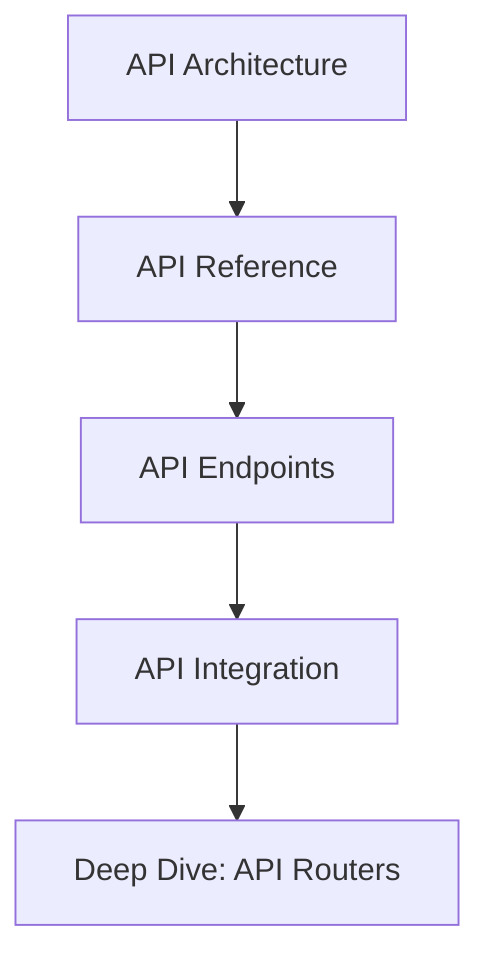

# API Documentation

This directory contains comprehensive documentation for the Open WebUI backend API.

## Contents

### API Design
- [API Architecture](api_architecture.md) - API design principles and patterns
- [API Reference](api_reference.md) - Complete API documentation
- [API Endpoints](api_endpoints.md) - Detailed endpoint specifications
- [API Integration](api_integration.md) - Integration guidelines and examples
- [Deep Dive: API Routers](deep_dive_api_routers.md) - Detailed router implementation

## Related Documentation
- See [components/README.md](../components/README.md) for component implementation
- See [security/README.md](../security/README.md) for API security
- See [diagrams/README.md](../diagrams/README.md) for API flow diagrams

## API Structure

## Key Concepts
- RESTful API Design
- API Authentication
- Request/Response Patterns
- Error Handling
- Rate Limiting
- API Versioning

## Last Updated
- API Architecture: 2024-03-21
- API Reference: 2024-03-21
- API Endpoints: 2024-03-21
- API Integration: 2024-03-21
- Deep Dive: API Routers: 2024-03-21 