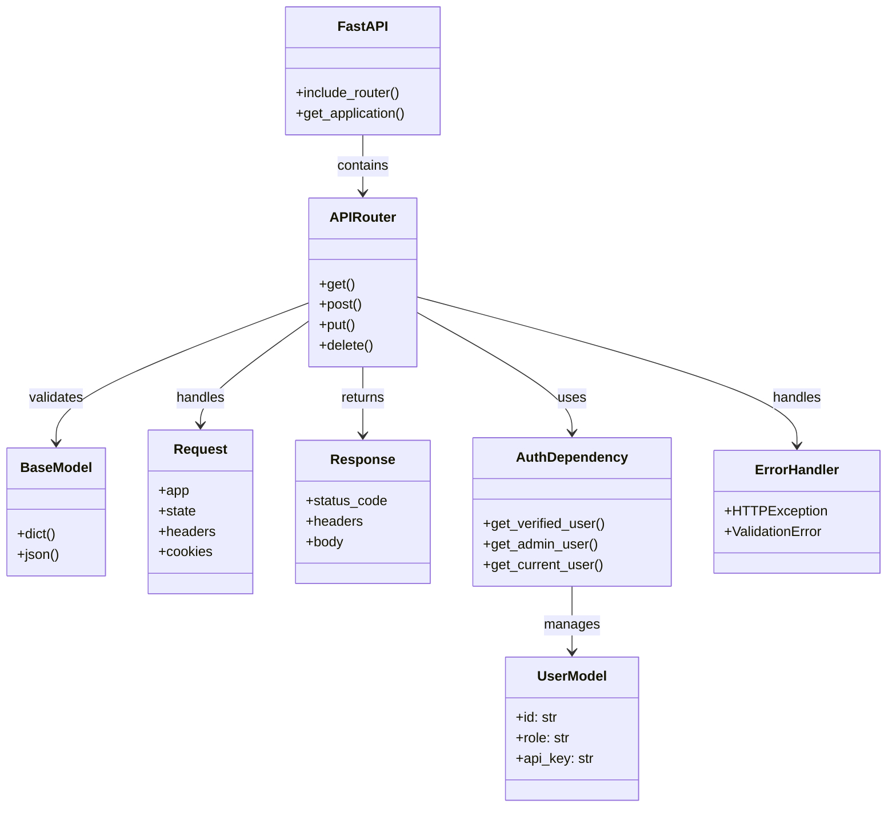
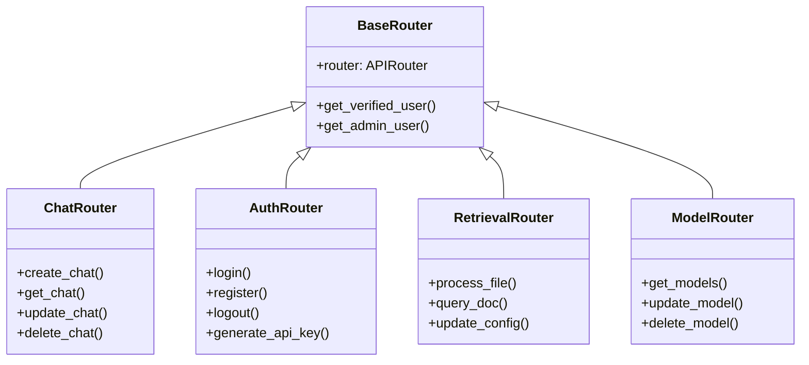
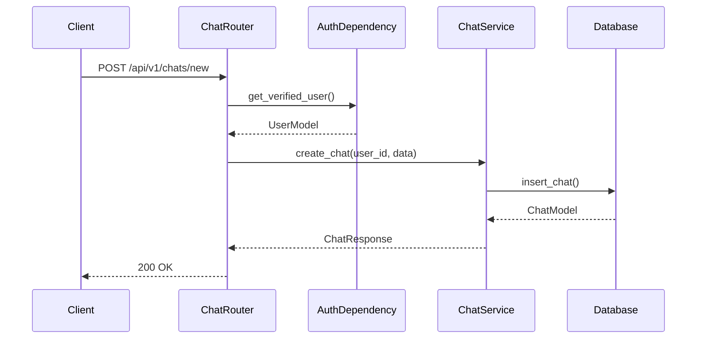
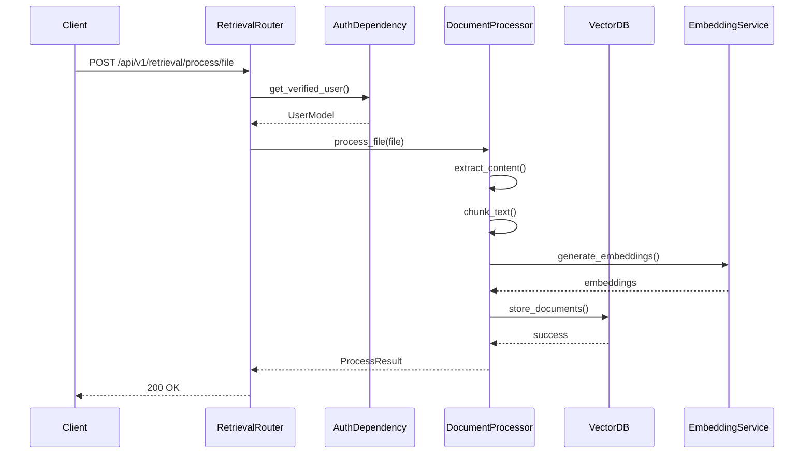
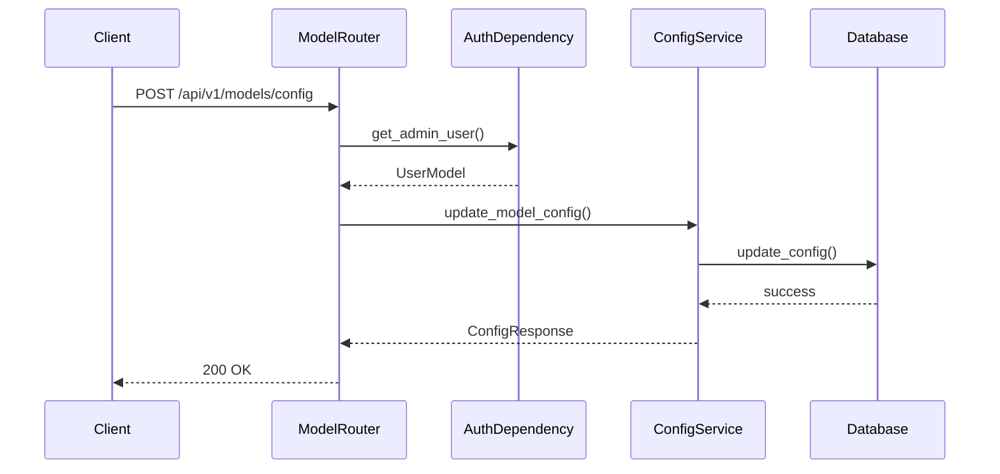

# API Architecture Documentation

This document provides a comprehensive overview of the API architecture, including class diagrams and sequence diagrams for key operations.

## Class Diagram

## Router Class Diagram

## Sequence Diagrams

### 1. Chat Creation Flow

### 2. RAG Document Processing Flow

### 3. Model Configuration Update Flow

## Component Details

### 1. Core Components

#### FastAPI Application
- Main application instance
- Router registration
- Middleware configuration
- Error handling

#### APIRouter
- Route registration
- Request handling
- Response formatting
- Dependency injection

#### Base Models
- Request validation
- Response serialization
- Data transfer objects

### 2. Authentication & Authorization

#### AuthDependency
- User verification
- Role-based access control
- API key management
- Session handling

#### UserModel
- User data structure
- Role management
- API key storage
- Permissions

### 3. Error Handling

#### HTTPException
- Status code mapping
- Error message formatting
- Response structure

#### ValidationError
- Input validation
- Schema validation
- Error reporting

## Best Practices

1. **Router Organization**
   - Group related endpoints
   - Use consistent naming
   - Implement proper versioning

2. **Authentication**
   - Always verify user identity
   - Implement role-based access
   - Secure API key handling

3. **Error Handling**
   - Consistent error responses
   - Proper status codes
   - Detailed error messages

4. **Performance**
   - Efficient database queries
   - Proper caching
   - Async operations

5. **Security**
   - Input validation
   - Output sanitization
   - Rate limiting

6. **Documentation**
   - Clear endpoint descriptions
   - Request/response examples
   - Error scenarios 