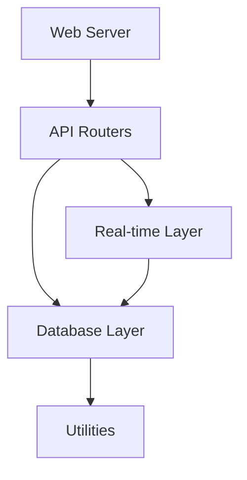

# Core Components Documentation

This directory contains documentation for the core system components of the Open WebUI backend.

## Contents

### Web Components
- [Web Server](web_server.md) - Web server implementation and configuration
- [API Routers](api_routers.md) - API routing system and endpoint management
- [Real-time Layer](real_time_layer.md) - Real-time communication implementation

### Data Components
- [Database Layer](database_layer.md) - Database architecture and management
- [Utilities](utilities.md) - Common utilities and helper functions

## Related Documentation
- See [api/README.md](../api/README.md) for API documentation
- See [data/README.md](../data/README.md) for data management
- See [system/README.md](../system/README.md) for system architecture

## Component Relationships

## Key Concepts
- Web Server Architecture
- API Routing System
- Real-time Communication
- Database Management
- Utility Functions

## Last Updated
- Web Server: 2024-03-21
- API Routers: 2024-03-21
- Database Layer: 2024-03-21
- Real-time Layer: 2024-03-21
- Utilities: 2024-03-21 