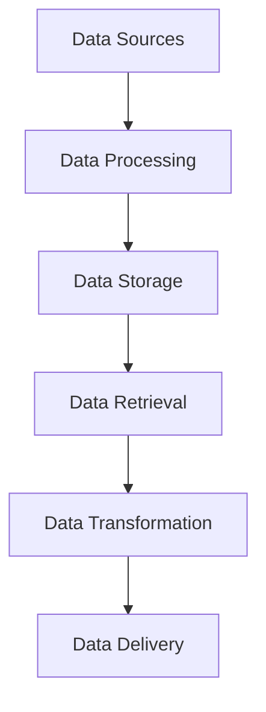

# Data Management Documentation

This directory contains documentation for data management and flow in the Open WebUI backend.

## Contents

### Data Architecture
- [Data Flow Architecture](data_flow_architecture.md) - Data flow patterns and architecture
- [Data Modeling](data_modeling.md) - Data models and schemas
- [Data Flow Sequences](data_flow_sequences.md) - Data flow diagrams and sequences
- [Data Transformation](data_transformation.md) - Data processing and transformation
- [Component Implementation](component_implementation.md) - Component implementation details
- [Chat History Management](chat_history_management.md) - Chat data handling

## Related Documentation
- See [components/README.md](../components/README.md) for database layer
- See [rag/README.md](../rag/README.md) for RAG system
- See [diagrams/README.md](../diagrams/README.md) for data flow diagrams

## Data Flow Overview

## Key Concepts
- Data Flow Patterns
- Data Models
- Data Transformation
- Data Storage
- Data Retrieval
- Chat History Management

## Last Updated
- Data Flow Architecture: 2024-03-21
- Data Modeling: 2024-03-21
- Data Flow Sequences: 2024-03-21
- Data Transformation: 2024-03-21
- Component Implementation: 2024-03-21
- Chat History Management: 2024-03-21 