# Data Flow Architecture

This document provides a comprehensive overview of how data flows through the Open WebUI backend system.

## Data Flow Overview

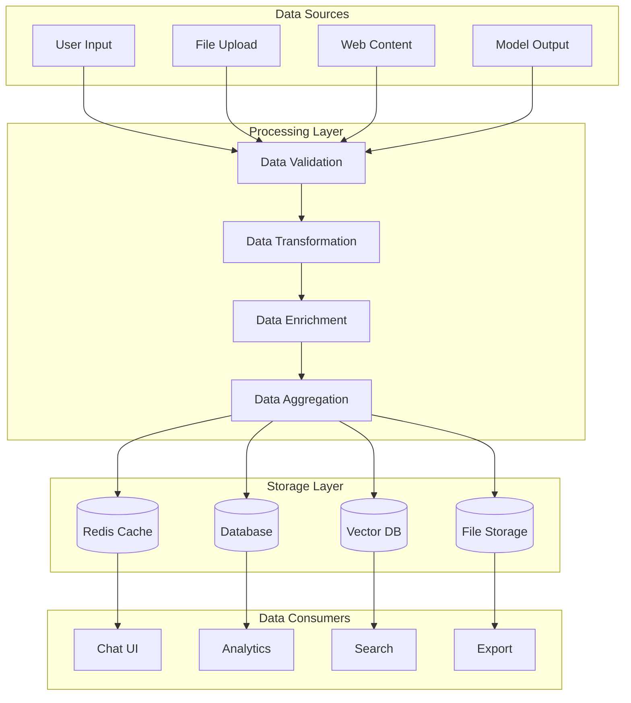

## Data Flow Patterns

### 1. Chat Data Flow
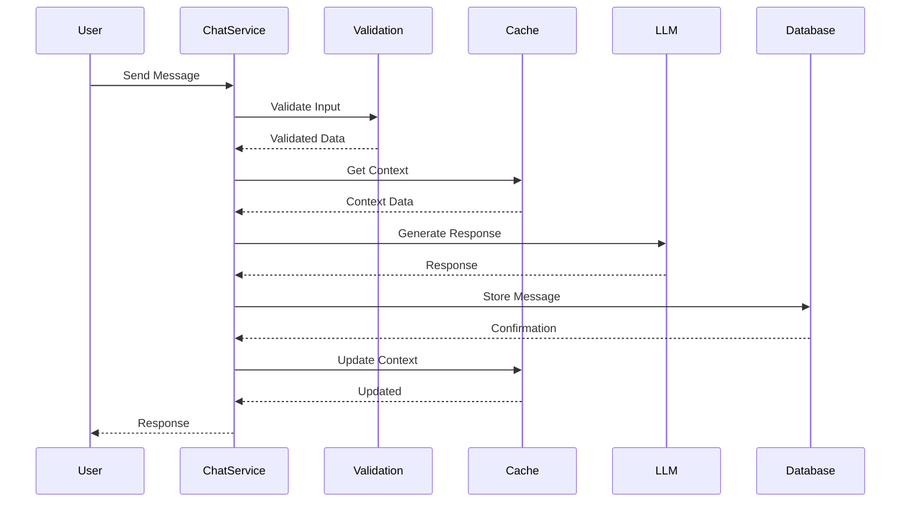

### 2. RAG Data Flow
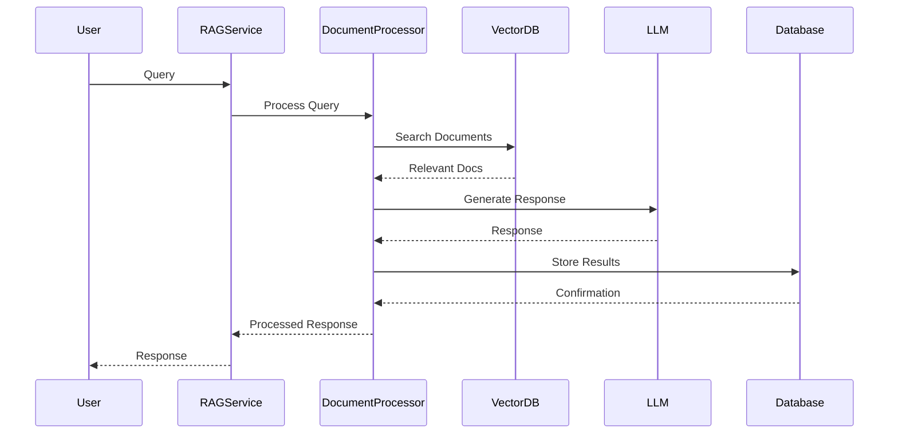

### 3. File Processing Flow
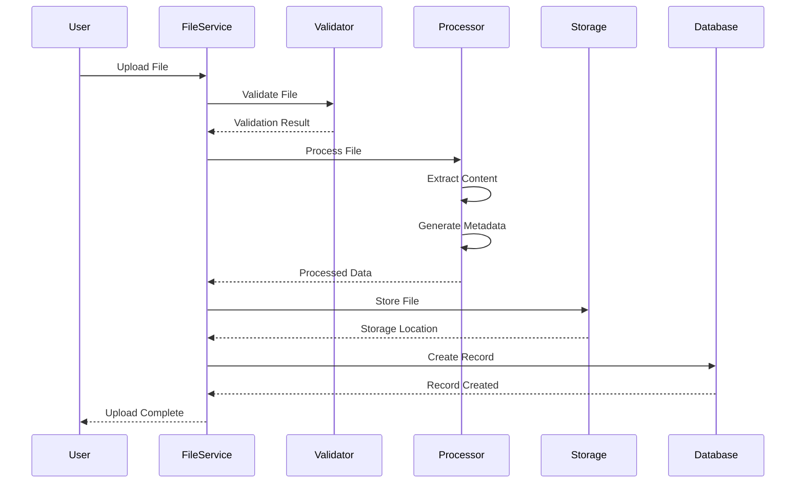

## Data Transformation

### 1. Input Processing
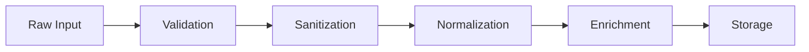

### 2. Output Processing
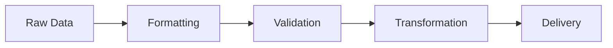

## Data Storage Patterns

### 1. Caching Strategy
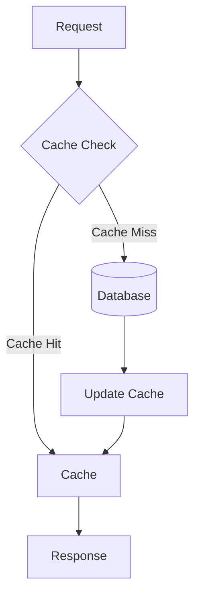

### 2. Data Persistence
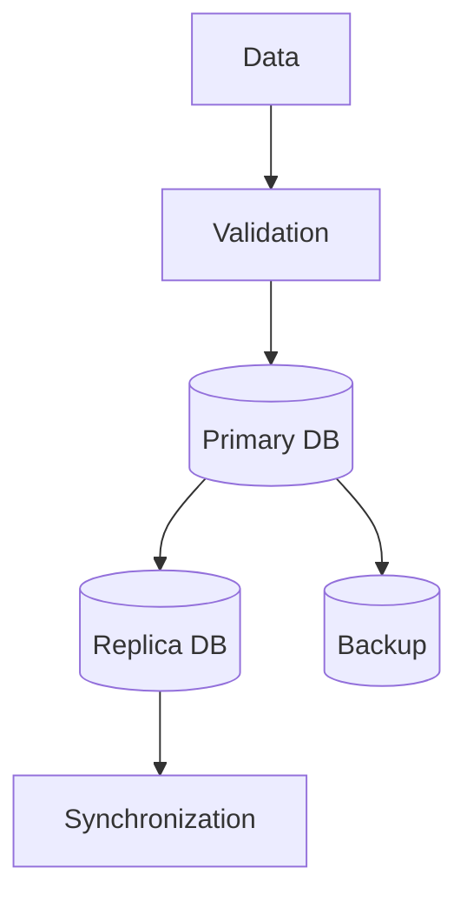

## Data Security

### 1. Data Protection Flow
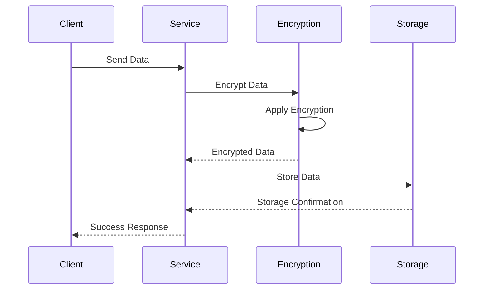

### 2. Access Control Flow
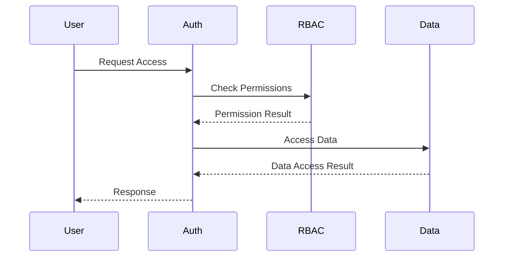

## Data Monitoring

### 1. Metrics Collection
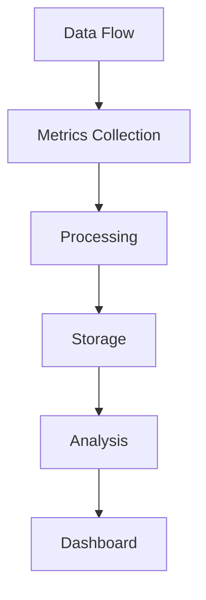

### 2. Error Tracking
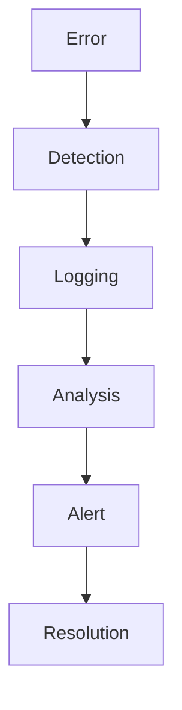

## Best Practices

### 1. Data Validation
- Input validation
- Schema validation
- Business rule validation
- Data type checking

### 2. Data Transformation
- Data cleaning
- Format conversion
- Data enrichment
- Data normalization

### 3. Data Storage
- Caching strategy
- Data partitioning
- Backup strategy
- Data retention

### 4. Data Security
- Encryption
- Access control
- Audit logging
- Data masking

### 5. Performance Optimization
- Query optimization
- Cache management
- Batch processing
- Async operations

### 6. Monitoring
- Data quality
- Performance metrics
- Error tracking
- Usage analytics 