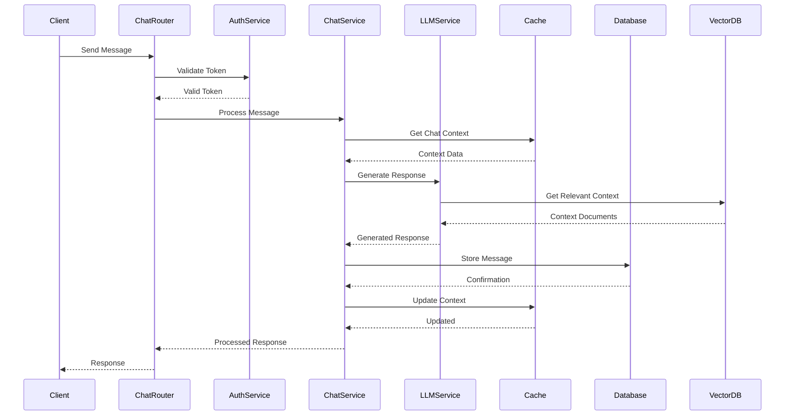
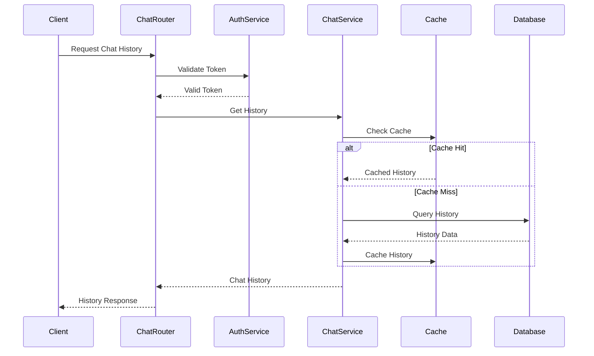
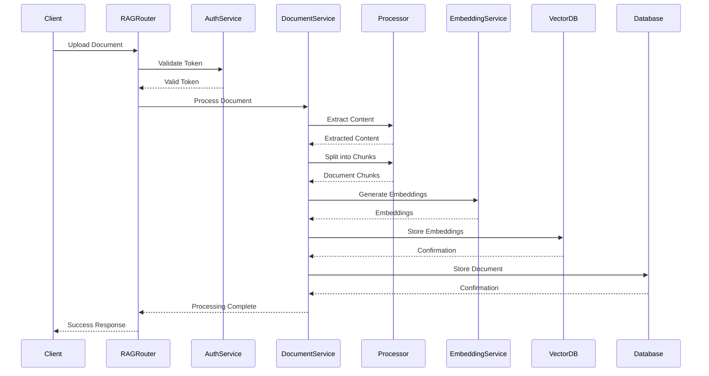
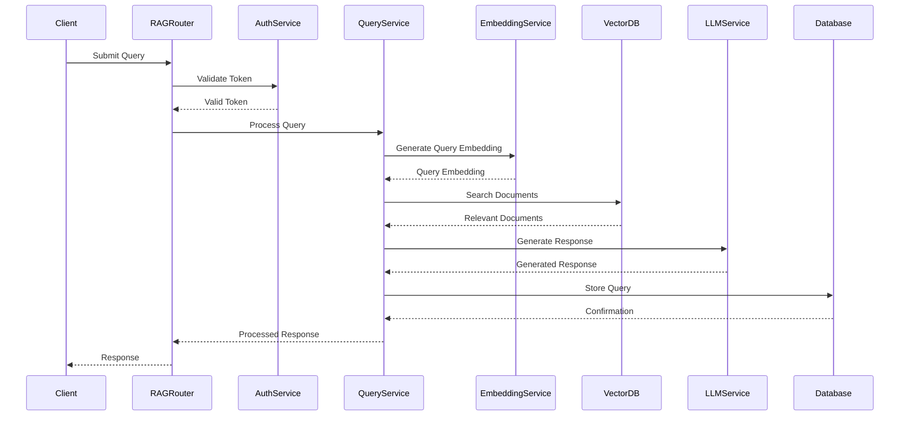
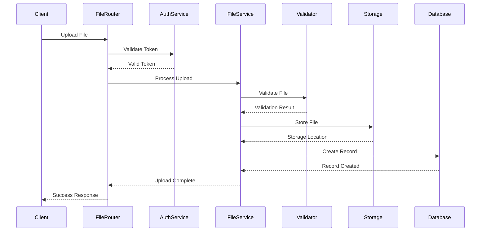
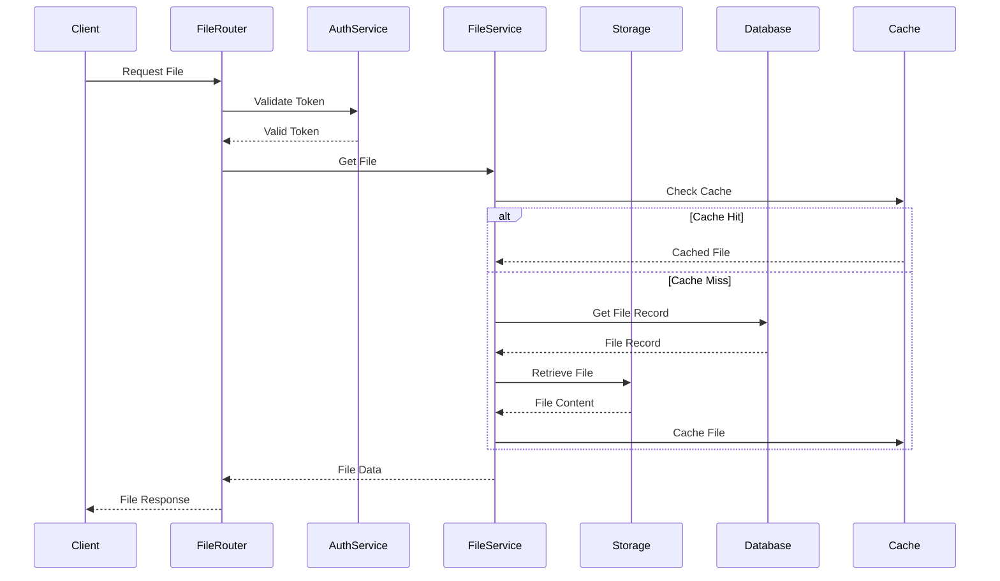
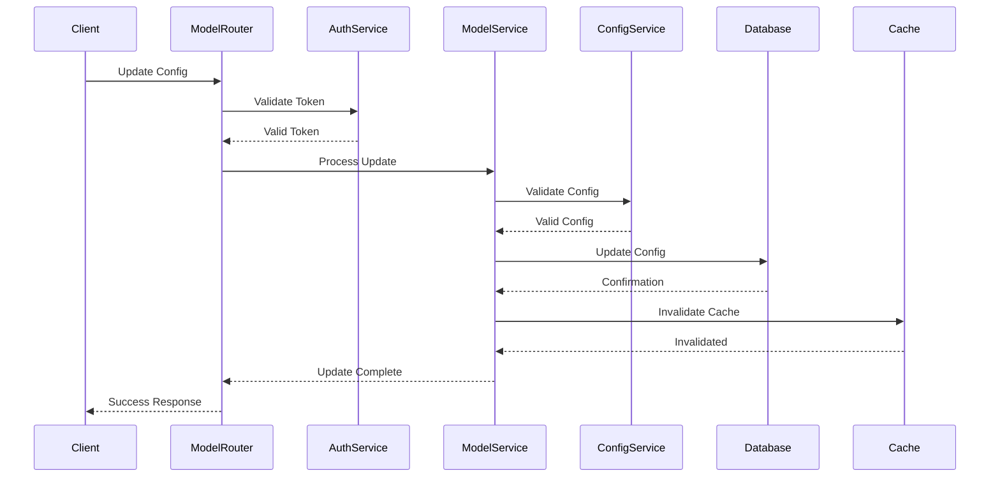
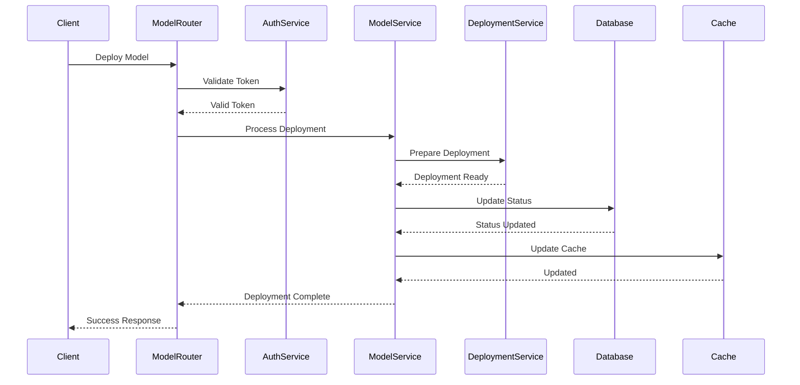
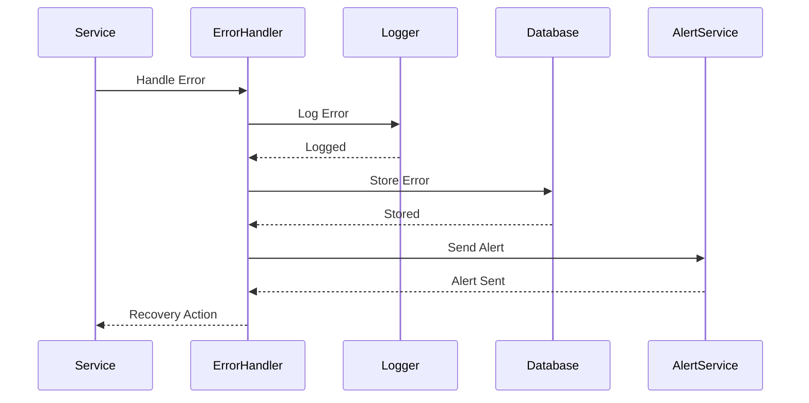

# Data Flow Sequence Diagrams

This document provides detailed sequence diagrams for specific data flows in the Open WebUI backend system.

## Chat System Data Flows

### 1. Chat Message Processing


### 2. Chat History Retrieval


## RAG System Data Flows

### 1. Document Processing Pipeline


### 2. RAG Query Processing


## File Management Data Flows

### 1. File Upload Process


### 2. File Retrieval Process


## Model Management Data Flows

### 1. Model Configuration Update


### 2. Model Deployment Process


## Error Handling Flows

### 1. Error Recovery Process


### 2. Retry Process
```mermaid
sequenceDiagram
    participant Service
    participant RetryHandler
    participant Backoff
    participant Target
    participant Logger

    Service->>RetryHandler: Handle Request
    loop Max Retries
        RetryHandler->>Target: Attempt Request
        alt Success
            Target-->>RetryHandler: Success
            RetryHandler-->>Service: Success
            break
        else Failure
            Target-->>RetryHandler: Error
            RetryHandler->>Logger: Log Attempt
            RetryHandler->>Backoff: Calculate Delay
            Backoff-->>RetryHandler: Delay Time
            RetryHandler->>RetryHandler: Wait
        end
    end
    RetryHandler-->>Service: Final Result
``` 