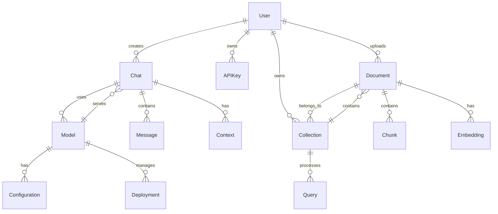
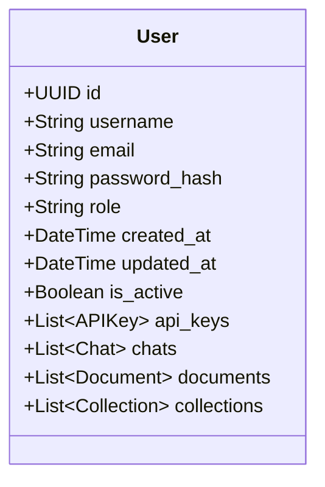
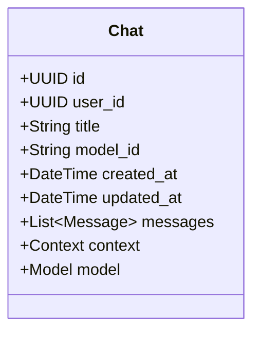
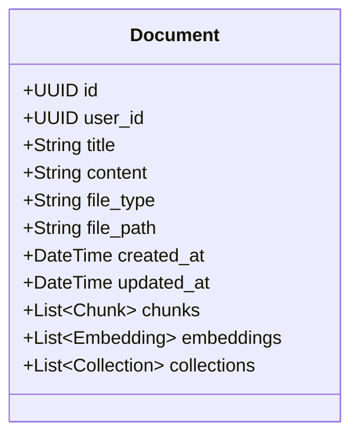
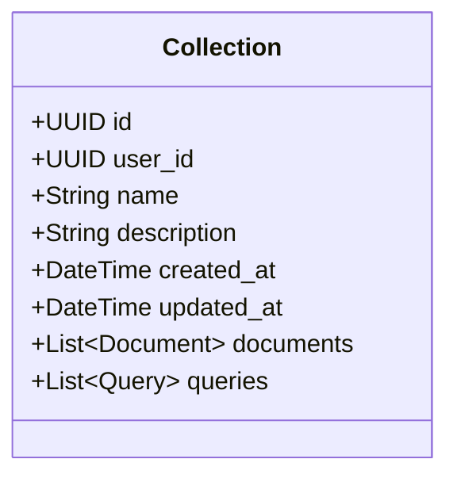
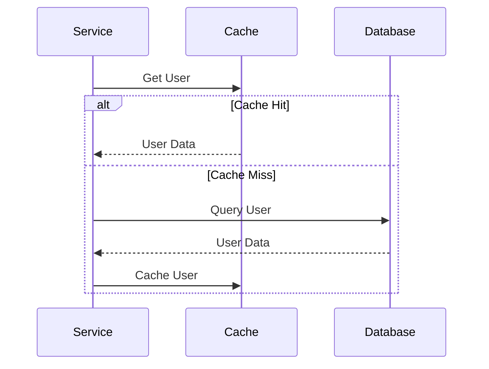
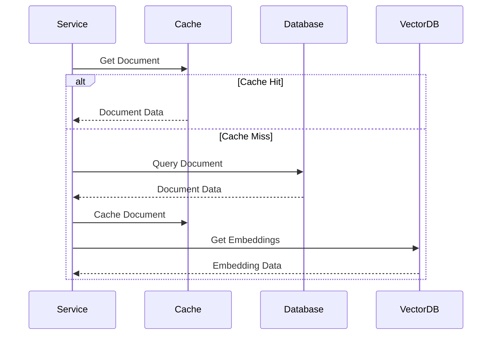

# Data Modeling Architecture

This document provides a comprehensive overview of the data models and their relationships in the Open WebUI backend system.

## Entity Relationship Diagram



## Core Entities

### 1. User Entity


### 2. Chat Entity


### 3. Document Entity


### 4. Collection Entity


## Data Structures

### 1. Message Structure
```json
{
    "id": "uuid",
    "chat_id": "uuid",
    "role": "user|assistant",
    "content": "string",
    "tokens": "integer",
    "created_at": "datetime",
    "metadata": {
        "model": "string",
        "temperature": "float",
        "top_p": "float"
    }
}
```

### 2. Document Structure
```json
{
    "id": "uuid",
    "user_id": "uuid",
    "title": "string",
    "content": "string",
    "file_type": "string",
    "file_path": "string",
    "created_at": "datetime",
    "updated_at": "datetime",
    "metadata": {
        "size": "integer",
        "mime_type": "string",
        "processing_status": "string"
    }
}
```

### 3. Embedding Structure
```json
{
    "id": "uuid",
    "document_id": "uuid",
    "chunk_id": "uuid",
    "vector": "float[]",
    "model": "string",
    "created_at": "datetime"
}
```

### 4. Query Structure
```json
{
    "id": "uuid",
    "collection_id": "uuid",
    "query": "string",
    "results": [
        {
            "document_id": "uuid",
            "chunk_id": "uuid",
            "score": "float",
            "content": "string"
        }
    ],
    "created_at": "datetime",
    "metadata": {
        "model": "string",
        "reranking": "boolean"
    }
}
```

## Database Schema

### 1. Users Table
```sql
CREATE TABLE users (
    id UUID PRIMARY KEY,
    username VARCHAR(255) UNIQUE NOT NULL,
    email VARCHAR(255) UNIQUE NOT NULL,
    password_hash VARCHAR(255) NOT NULL,
    role VARCHAR(50) NOT NULL,
    is_active BOOLEAN DEFAULT true,
    created_at TIMESTAMP WITH TIME ZONE DEFAULT CURRENT_TIMESTAMP,
    updated_at TIMESTAMP WITH TIME ZONE DEFAULT CURRENT_TIMESTAMP
);
```

### 2. Chats Table
```sql
CREATE TABLE chats (
    id UUID PRIMARY KEY,
    user_id UUID REFERENCES users(id),
    title VARCHAR(255),
    model_id VARCHAR(255) NOT NULL,
    created_at TIMESTAMP WITH TIME ZONE DEFAULT CURRENT_TIMESTAMP,
    updated_at TIMESTAMP WITH TIME ZONE DEFAULT CURRENT_TIMESTAMP
);
```

### 3. Documents Table
```sql
CREATE TABLE documents (
    id UUID PRIMARY KEY,
    user_id UUID REFERENCES users(id),
    title VARCHAR(255) NOT NULL,
    content TEXT,
    file_type VARCHAR(50),
    file_path VARCHAR(255),
    created_at TIMESTAMP WITH TIME ZONE DEFAULT CURRENT_TIMESTAMP,
    updated_at TIMESTAMP WITH TIME ZONE DEFAULT CURRENT_TIMESTAMP
);
```

### 4. Collections Table
```sql
CREATE TABLE collections (
    id UUID PRIMARY KEY,
    user_id UUID REFERENCES users(id),
    name VARCHAR(255) NOT NULL,
    description TEXT,
    created_at TIMESTAMP WITH TIME ZONE DEFAULT CURRENT_TIMESTAMP,
    updated_at TIMESTAMP WITH TIME ZONE DEFAULT CURRENT_TIMESTAMP
);
```

## Indexes and Constraints

### 1. Primary Indexes
```sql
CREATE INDEX idx_users_id ON users(id);
CREATE INDEX idx_chats_id ON chats(id);
CREATE INDEX idx_documents_id ON documents(id);
CREATE INDEX idx_collections_id ON collections(id);
```

### 2. Foreign Key Indexes
```sql
CREATE INDEX idx_chats_user_id ON chats(user_id);
CREATE INDEX idx_documents_user_id ON documents(user_id);
CREATE INDEX idx_collections_user_id ON collections(user_id);
```

### 3. Search Indexes
```sql
CREATE INDEX idx_documents_title ON documents USING gin(to_tsvector('english', title));
CREATE INDEX idx_collections_name ON collections USING gin(to_tsvector('english', name));
```

## Data Access Patterns

### 1. User Data Access


### 2. Document Data Access


## Data Integrity

### 1. Constraints
- Primary key constraints
- Foreign key constraints
- Unique constraints
- Check constraints

### 2. Triggers
- Updated timestamp triggers
- Soft delete triggers
- Audit log triggers
- Data validation triggers

### 3. Cascading
- Delete cascading
- Update cascading
- Insert cascading
- Merge cascading 