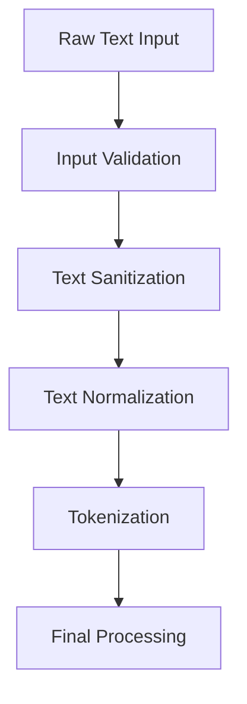
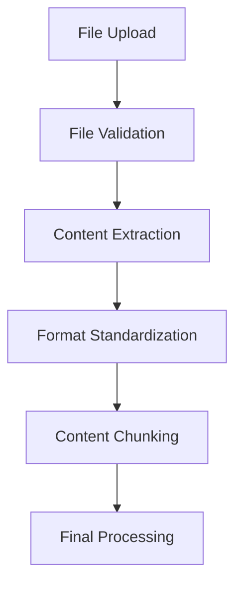
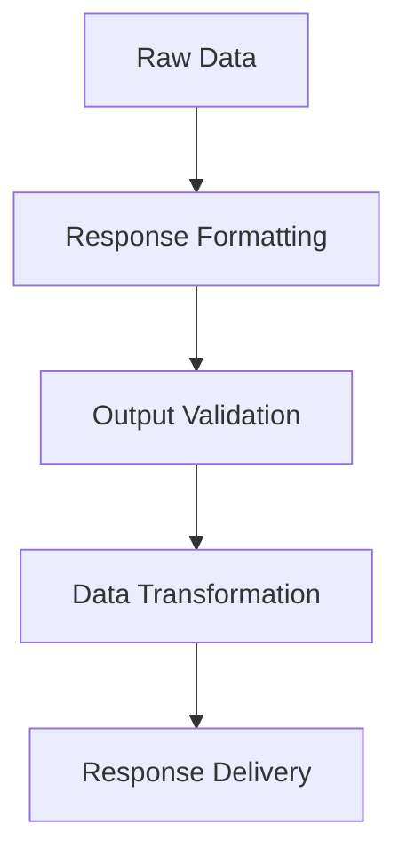
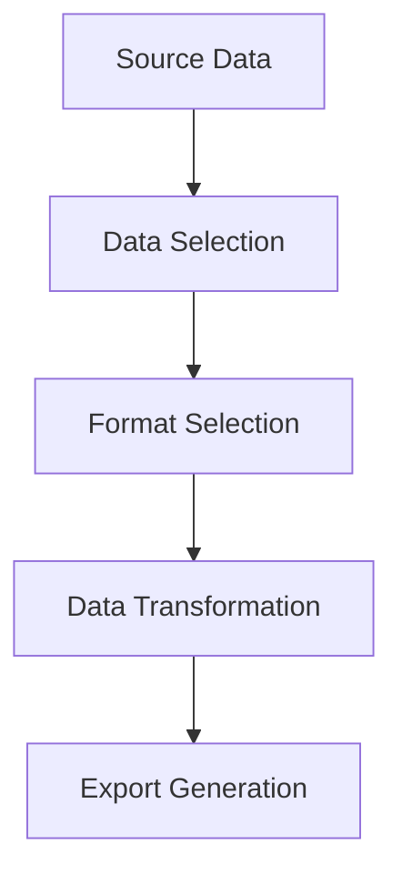

# Data Transformation Architecture

This document provides a comprehensive overview of data transformation processes in the Open WebUI backend system.

## Input Processing Pipeline

### 1. Text Input Processing


### 2. File Input Processing


## Data Transformation Components

### 1. Text Processing
```python
class TextProcessor:
    def process_text(self, text: str) -> ProcessedText:
        # Input validation
        validated_text = self.validate_input(text)
        
        # Text sanitization
        sanitized_text = self.sanitize_text(validated_text)
        
        # Text normalization
        normalized_text = self.normalize_text(sanitized_text)
        
        # Tokenization
        tokens = self.tokenize_text(normalized_text)
        
        return ProcessedText(
            original=text,
            processed=normalized_text,
            tokens=tokens
        )
```

### 2. Document Processing
```python
class DocumentProcessor:
    def process_document(self, document: Document) -> ProcessedDocument:
        # File validation
        validated_doc = self.validate_document(document)
        
        # Content extraction
        content = self.extract_content(validated_doc)
        
        # Format standardization
        standardized = self.standardize_format(content)
        
        # Content chunking
        chunks = self.chunk_content(standardized)
        
        return ProcessedDocument(
            original=document,
            content=standardized,
            chunks=chunks
        )
```

## Output Processing Pipeline

### 1. Response Generation


### 2. Data Export


## Data Transformation Patterns

### 1. Input Validation
```python
class InputValidator:
    def validate_input(self, input_data: Any) -> ValidatedInput:
        # Type validation
        if not isinstance(input_data, expected_type):
            raise ValidationError("Invalid input type")
            
        # Content validation
        if not self.validate_content(input_data):
            raise ValidationError("Invalid content")
            
        # Size validation
        if not self.validate_size(input_data):
            raise ValidationError("Input too large")
            
        return ValidatedInput(input_data)
```

### 2. Data Normalization
```python
class DataNormalizer:
    def normalize_data(self, data: Any) -> NormalizedData:
        # Case normalization
        normalized = self.normalize_case(data)
        
        # Whitespace normalization
        normalized = self.normalize_whitespace(normalized)
        
        # Special character handling
        normalized = self.handle_special_chars(normalized)
        
        return NormalizedData(normalized)
```

### 3. Format Conversion
```python
class FormatConverter:
    def convert_format(self, data: Any, target_format: str) -> ConvertedData:
        # Source format detection
        source_format = self.detect_format(data)
        
        # Format conversion
        converted = self.convert(data, source_format, target_format)
        
        # Validation
        self.validate_conversion(converted, target_format)
        
        return ConvertedData(converted)
```

## Data Enrichment

### 1. Metadata Addition
```python
class MetadataEnricher:
    def enrich_data(self, data: Any) -> EnrichedData:
        # Basic metadata
        metadata = self.generate_basic_metadata(data)
        
        # Extended metadata
        metadata.update(self.generate_extended_metadata(data))
        
        # Validation metadata
        metadata.update(self.generate_validation_metadata(data))
        
        return EnrichedData(data, metadata)
```

### 2. Data Augmentation
```python
class DataAugmentor:
    def augment_data(self, data: Any) -> AugmentedData:
        # Content augmentation
        augmented = self.augment_content(data)
        
        # Feature augmentation
        augmented = self.augment_features(augmented)
        
        # Quality checks
        self.validate_augmentation(augmented)
        
        return AugmentedData(augmented)
```

## Data Quality Assurance

### 1. Quality Checks
```python
class QualityChecker:
    def check_quality(self, data: Any) -> QualityReport:
        # Completeness check
        completeness = self.check_completeness(data)
        
        # Consistency check
        consistency = self.check_consistency(data)
        
        # Accuracy check
        accuracy = self.check_accuracy(data)
        
        return QualityReport(
            completeness=completeness,
            consistency=consistency,
            accuracy=accuracy
        )
```

### 2. Data Cleaning
```python
class DataCleaner:
    def clean_data(self, data: Any) -> CleanedData:
        # Remove duplicates
        cleaned = self.remove_duplicates(data)
        
        # Handle missing values
        cleaned = self.handle_missing_values(cleaned)
        
        # Fix inconsistencies
        cleaned = self.fix_inconsistencies(cleaned)
        
        return CleanedData(cleaned)
```

## Performance Optimization

### 1. Batch Processing
```python
class BatchProcessor:
    def process_batch(self, items: List[Any]) -> List[ProcessedItem]:
        # Batch preparation
        prepared = self.prepare_batch(items)
        
        # Parallel processing
        processed = self.process_parallel(prepared)
        
        # Result aggregation
        results = self.aggregate_results(processed)
        
        return results
```

### 2. Caching Strategy
```python
class CacheManager:
    def manage_cache(self, data: Any) -> CachedData:
        # Cache key generation
        key = self.generate_cache_key(data)
        
        # Cache lookup
        cached = self.lookup_cache(key)
        
        if cached:
            return CachedData(cached)
            
        # Cache update
        self.update_cache(key, data)
        
        return CachedData(data)
```

## Error Handling

### 1. Transformation Error Handling
```python
class TransformationErrorHandler:
    def handle_error(self, error: Exception) -> ErrorResponse:
        # Error classification
        error_type = self.classify_error(error)
        
        # Error logging
        self.log_error(error, error_type)
        
        # Recovery attempt
        recovery = self.attempt_recovery(error)
        
        return ErrorResponse(
            error_type=error_type,
            recovery=recovery
        )
```

### 2. Data Recovery
```python
class DataRecovery:
    def recover_data(self, corrupted_data: Any) -> RecoveredData:
        # Corruption detection
        corruption = self.detect_corruption(corrupted_data)
        
        # Recovery strategy
        strategy = self.select_recovery_strategy(corruption)
        
        # Data recovery
        recovered = self.recover(corrupted_data, strategy)
        
        return RecoveredData(recovered)
``` 