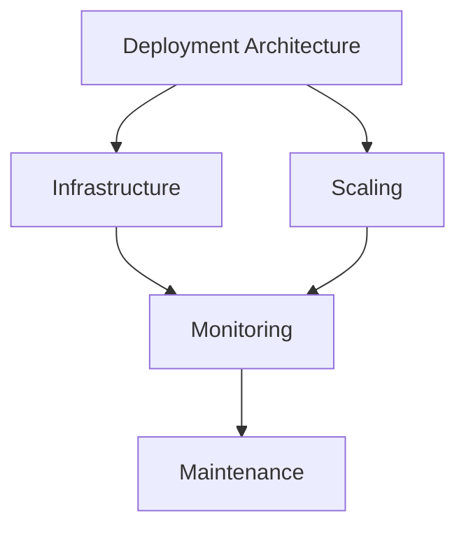

# Deployment Documentation

This directory contains documentation for deployment and infrastructure in the Open WebUI backend.

## Contents

### Deployment Architecture
- [Deployment Architecture](deployment_architecture.md) - Deployment design and patterns
- [Deployment and Scaling](deployment_and_scaling.md) - Scaling strategies and implementation
- [Deployment Infrastructure](deployment_infrastructure.md) - Infrastructure setup and management

## Related Documentation
- See [monitoring/README.md](../monitoring/README.md) for deployment monitoring
- See [security/README.md](../security/README.md) for deployment security
- See [testing/README.md](../testing/README.md) for deployment testing

## Deployment Overview

## Key Concepts
- Infrastructure Setup
- Scaling Strategies
- Deployment Patterns
- Monitoring
- Maintenance
- Disaster Recovery

## Last Updated
- Deployment Architecture: 2024-03-21
- Deployment and Scaling: 2024-03-21
- Deployment Infrastructure: 2024-03-21 