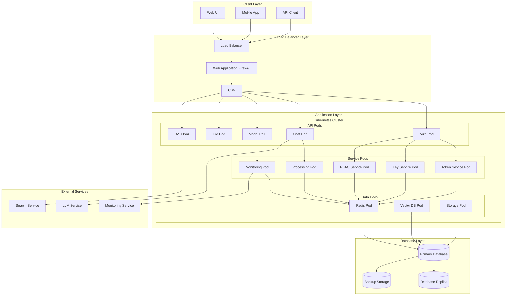
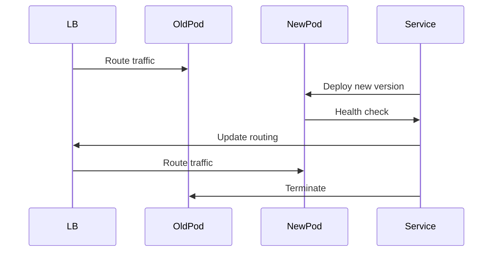
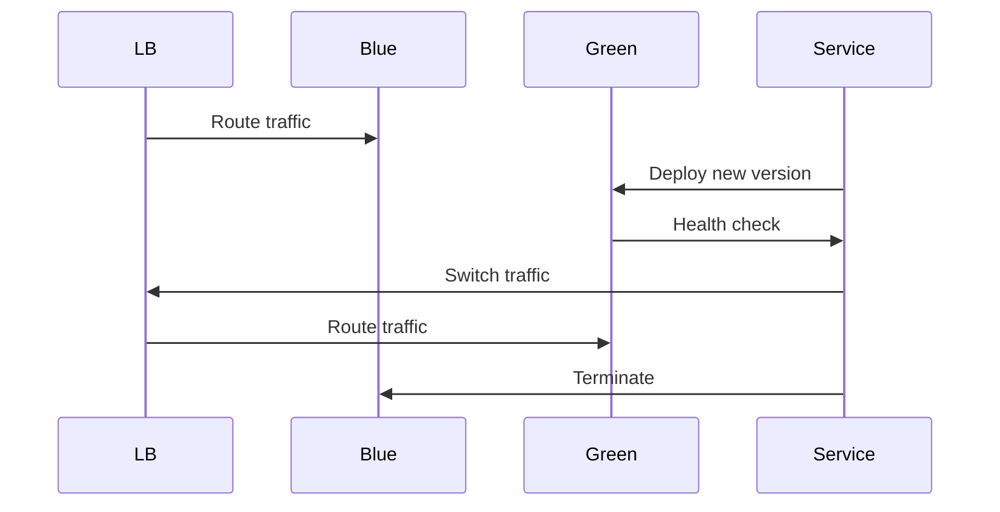
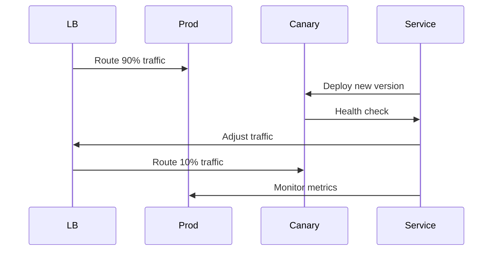

# Deployment Architecture

This document provides a comprehensive overview of the deployment architecture for the Open WebUI backend.

## Deployment Architecture Diagram

## Deployment Components

### 1. Infrastructure Layer
- **Load Balancer**
  - Request distribution
  - SSL termination
  - Health checks
  - Rate limiting

- **CDN**
  - Static content delivery
  - Edge caching
  - Geographic distribution
  - DDoS protection

- **WAF**
  - Security rules
  - Request filtering
  - Bot protection
  - OWASP protection

### 2. Kubernetes Cluster
- **API Pods**
  - Horizontal scaling
  - Resource limits
  - Health probes
  - Liveness checks

- **Service Pods**
  - Service discovery
  - Load balancing
  - Auto-scaling
  - Resource management

- **Data Pods**
  - Stateful sets
  - Persistent volumes
  - Data replication
  - Backup management

### 3. Database Layer
- **Primary Database**
  - High availability
  - Data consistency
  - Transaction management
  - Query optimization

- **Database Replica**
  - Read scaling
  - Failover support
  - Data synchronization
  - Backup source

- **Backup Storage**
  - Point-in-time recovery
  - Disaster recovery
  - Data retention
  - Backup scheduling

### 4. External Services
- **LLM Service**
  - Model deployment
  - Inference optimization
  - Cost management
  - Performance monitoring

- **Search Service**
  - Search optimization
  - Result caching
  - Rate limiting
  - Error handling

- **Monitoring Service**
  - Metrics collection
  - Log aggregation
  - Alert management
  - Performance analysis

## Deployment Strategies

### 1. Rolling Updates

### 2. Blue-Green Deployment

### 3. Canary Deployment

## Scaling Strategies

### 1. Horizontal Scaling
- Pod replication
- Load distribution
- Resource utilization
- Auto-scaling rules

### 2. Vertical Scaling
- Resource allocation
- Performance optimization
- Cost management
- Resource limits

### 3. Database Scaling
- Read replicas
- Sharding
- Connection pooling
- Query optimization

## Monitoring and Maintenance

### 1. Health Monitoring
- Pod health
- Service health
- Database health
- External service health

### 2. Performance Monitoring
- Response times
- Resource usage
- Error rates
- Throughput

### 3. Maintenance Procedures
- Backup procedures
- Update procedures
- Rollback procedures
- Disaster recovery

## Security Considerations

### 1. Network Security
- Network policies
- Service mesh
- TLS encryption
- Access control

### 2. Data Security
- Encryption at rest
- Encryption in transit
- Access control
- Audit logging

### 3. Application Security
- Input validation
- Authentication
- Authorization
- Rate limiting 