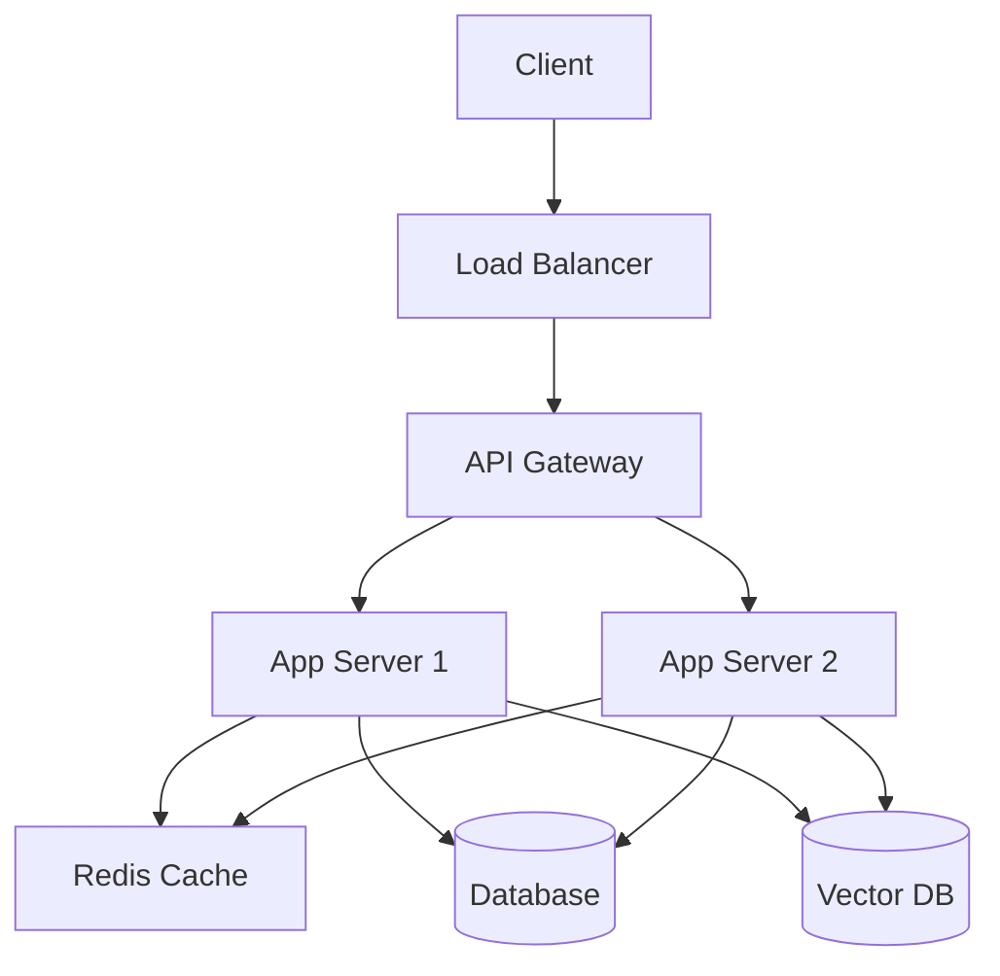

# Deployment and Infrastructure Documentation

This document provides comprehensive documentation for the deployment and infrastructure setup of the Open WebUI backend system.

## Infrastructure Overview

### System Architecture


## Container Orchestration

### 1. Kubernetes Deployment
```yaml
apiVersion: apps/v1
kind: Deployment
metadata:
  name: open-webui-backend
spec:
  replicas: 3
  selector:
    matchLabels:
      app: open-webui-backend
  template:
    metadata:
      labels:
        app: open-webui-backend
    spec:
      containers:
      - name: backend
        image: open-webui-backend:latest
        ports:
        - containerPort: 8000
        resources:
          requests:
            memory: "1Gi"
            cpu: "500m"
          limits:
            memory: "2Gi"
            cpu: "1000m"
        env:
        - name: DATABASE_URL
          valueFrom:
            secretKeyRef:
              name: app-secrets
              key: database-url
        - name: REDIS_URL
          valueFrom:
            secretKeyRef:
              name: app-secrets
              key: redis-url
```

### 2. Service Configuration
```yaml
apiVersion: v1
kind: Service
metadata:
  name: open-webui-backend
spec:
  selector:
    app: open-webui-backend
  ports:
  - port: 80
    targetPort: 8000
  type: LoadBalancer
```

## Infrastructure Components

### 1. Load Balancer Configuration
```python
class LoadBalancerConfig:
    def __init__(self):
        self.algorithm = "least_connections"
        self.health_check = {
            "path": "/health",
            "port": 8000,
            "interval": 30,
            "timeout": 5,
            "healthy_threshold": 2,
            "unhealthy_threshold": 2
        }
        self.ssl_config = {
            "certificate_arn": "arn:aws:acm:...",
            "protocols": ["TLSv1.2"],
            "cipher_suites": [
                "ECDHE-ECDSA-AES256-GCM-SHA384",
                "ECDHE-RSA-AES256-GCM-SHA384"
            ]
        }
```

### 2. Auto Scaling Configuration
```yaml
apiVersion: autoscaling/v2
kind: HorizontalPodAutoscaler
metadata:
  name: open-webui-backend
spec:
  scaleTargetRef:
    apiVersion: apps/v1
    kind: Deployment
    name: open-webui-backend
  minReplicas: 3
  maxReplicas: 10
  metrics:
  - type: Resource
    resource:
      name: cpu
      target:
        type: Utilization
        averageUtilization: 70
  - type: Resource
    resource:
      name: memory
      target:
        type: Utilization
        averageUtilization: 80
```

## Service Mesh

### 1. Istio Configuration
```yaml
apiVersion: networking.istio.io/v1alpha3
kind: VirtualService
metadata:
  name: open-webui-backend
spec:
  hosts:
  - "api.openwebui.com"
  gateways:
  - open-webui-gateway
  http:
  - route:
    - destination:
        host: open-webui-backend
        port:
          number: 8000
    retries:
      attempts: 3
      perTryTimeout: "2s"
    timeout: "10s"
```

### 2. Traffic Management
```python
class TrafficManager:
    def __init__(self):
        self.routing_rules = {
            "canary": {
                "weight": 10,
                "version": "v2"
            },
            "production": {
                "weight": 90,
                "version": "v1"
            }
        }
        
    async def update_routing(
        self,
        service: str,
        rules: Dict[str, Any]
    ) -> None:
        """Update service routing rules."""
        await self.istio_client.update_virtual_service(
            service,
            rules
        )
```

## Database Management

### 1. Database Replication
```yaml
apiVersion: apps/v1
kind: StatefulSet
metadata:
  name: postgres
spec:
  serviceName: postgres
  replicas: 3
  selector:
    matchLabels:
      app: postgres
  template:
    metadata:
      labels:
        app: postgres
    spec:
      containers:
      - name: postgres
        image: postgres:13
        ports:
        - containerPort: 5432
        volumeMounts:
        - name: data
          mountPath: /var/lib/postgresql/data
  volumeClaimTemplates:
  - metadata:
      name: data
    spec:
      accessModes: [ "ReadWriteOnce" ]
      resources:
        requests:
          storage: 10Gi
```

### 2. Database Backup
```python
class DatabaseBackup:
    def __init__(self, storage: Storage):
        self.storage = storage
        self.retention_days = 30
        
    async def create_backup(self) -> str:
        """Create database backup."""
        timestamp = datetime.utcnow().strftime("%Y%m%d_%H%M%S")
        backup_file = f"backup_{timestamp}.sql"
        
        # Create backup
        await self.execute_backup(backup_file)
        
        # Upload to storage
        await self.storage.upload(backup_file)
        
        # Cleanup old backups
        await self.cleanup_old_backups()
        
        return backup_file
```

## Monitoring and Logging

### 1. Prometheus Configuration
```yaml
apiVersion: monitoring.coreos.com/v1
kind: ServiceMonitor
metadata:
  name: open-webui-backend
spec:
  selector:
    matchLabels:
      app: open-webui-backend
  endpoints:
  - port: metrics
    interval: 15s
    path: /metrics
```

### 2. Logging Configuration
```python
class LoggingConfig:
    def __init__(self):
        self.log_level = "INFO"
        self.log_format = "%(asctime)s - %(name)s - %(levelname)s - %(message)s"
        self.log_handlers = {
            "file": {
                "filename": "/var/log/app.log",
                "max_bytes": 10485760,  # 10MB
                "backup_count": 5
            },
            "elasticsearch": {
                "host": "elasticsearch:9200",
                "index": "app-logs"
            }
        }
```

## Disaster Recovery

### 1. Backup Strategy
```python
class BackupStrategy:
    def __init__(self):
        self.backup_schedule = {
            "database": "0 0 * * *",  # Daily
            "files": "0 */6 * * *",   # Every 6 hours
            "config": "0 0 * * *"     # Daily
        }
        
    async def execute_backup(self, type: str) -> None:
        """Execute backup based on type."""
        if type == "database":
            await self.backup_database()
        elif type == "files":
            await self.backup_files()
        elif type == "config":
            await self.backup_config()
```

### 2. Recovery Procedures
```python
class RecoveryManager:
    def __init__(self):
        self.recovery_procedures = {
            "database": self.recover_database,
            "files": self.recover_files,
            "config": self.recover_config
        }
        
    async def recover(self, type: str, backup_id: str) -> None:
        """Recover system from backup."""
        if type in self.recovery_procedures:
            await self.recovery_procedures[type](backup_id)
```

## Best Practices

### 1. Infrastructure
- Use infrastructure as code
- Implement proper resource tagging
- Use managed services where possible
- Implement proper monitoring
- Use proper security groups

### 2. Deployment
- Use blue-green deployments
- Implement proper rollback procedures
- Use container orchestration
- Implement proper scaling
- Use proper health checks

### 3. Database
- Use proper replication
- Implement proper backups
- Use proper indexing
- Implement proper monitoring
- Use proper security

### 4. Monitoring
- Use proper metrics
- Implement proper alerts
- Use proper logging
- Implement proper tracing
- Use proper dashboards

### 5. Security
- Use proper authentication
- Implement proper authorization
- Use proper encryption
- Implement proper firewalls
- Use proper secrets management

### 6. Performance
- Use proper caching
- Implement proper load balancing
- Use proper CDN
- Implement proper optimization
- Use proper monitoring 