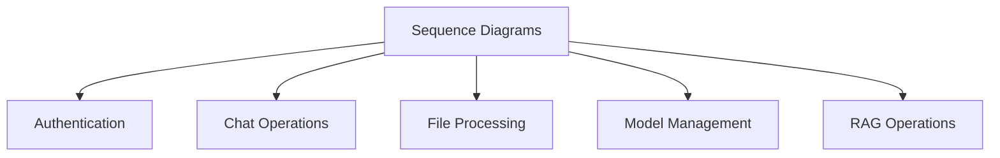

# Sequence Diagrams Documentation

This directory contains sequence diagrams for various system operations in the Open WebUI backend.

## Contents

### System Flow Diagrams
- [Authentication Sequence](auth_sequence_diagram.md) - Authentication flow
- [Chat Sequence](chat_sequence_diagram.md) - Chat operations flow
- [File Processing Sequence](file_sequence_diagram.md) - File handling flow
- [Model Management Sequence](model_sequence_diagram.md) - Model operations flow
- [RAG Sequence](rag_sequence_diagram.md) - RAG operations flow

## Related Documentation
- See [api/README.md](../api/README.md) for API flows
- See [data/README.md](../data/README.md) for data flows
- See [rag/README.md](../rag/README.md) for RAG flows

## Diagram Overview

## Key Concepts
- Authentication Flow
- Chat Operations
- File Processing
- Model Management
- RAG Operations
- System Interactions

## Last Updated
- Authentication Sequence: 2024-03-21
- Chat Sequence: 2024-03-21
- File Processing Sequence: 2024-03-21
- Model Management Sequence: 2024-03-21
- RAG Sequence: 2024-03-21 