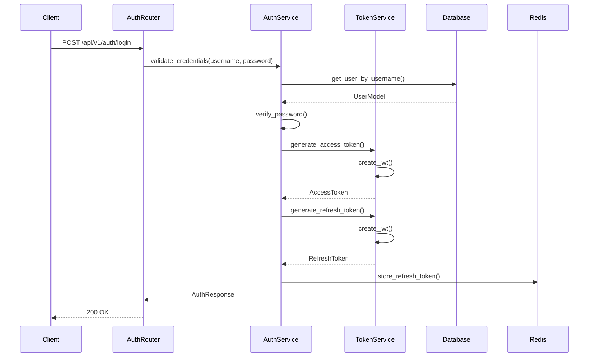
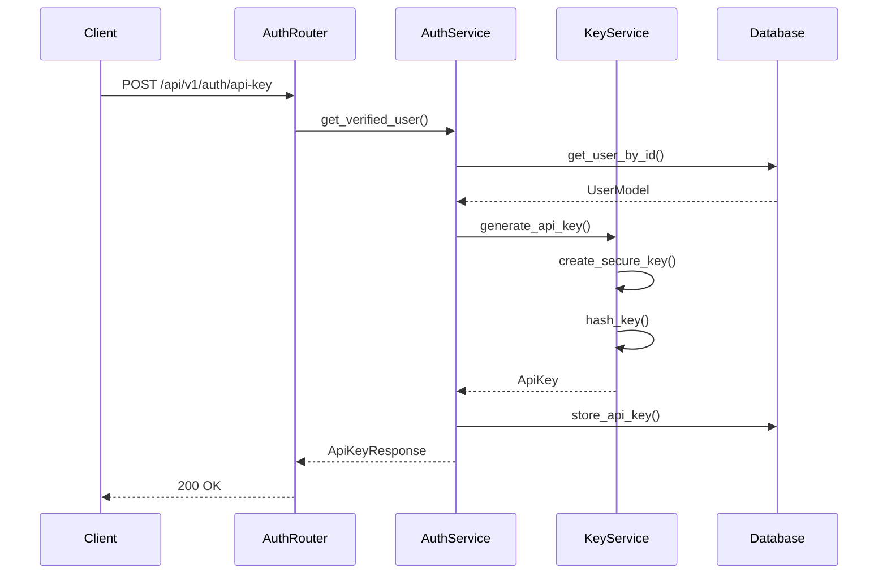
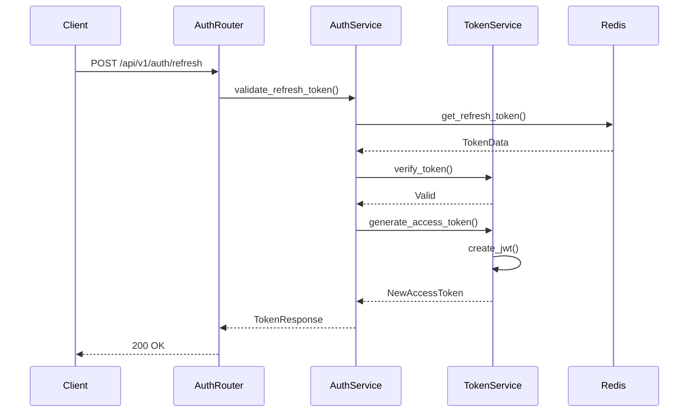
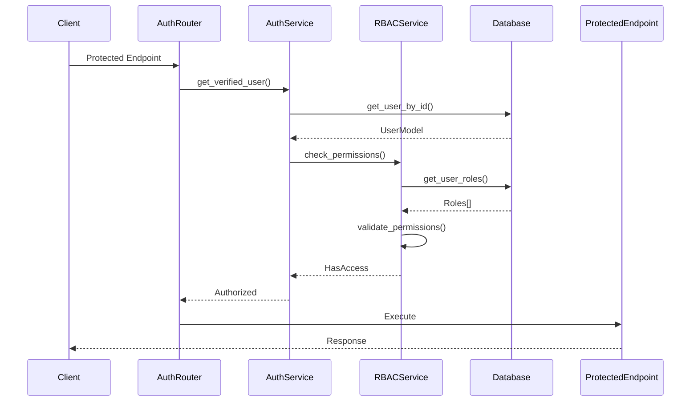

# Authentication and Authorization Sequence Diagrams

This document provides detailed sequence diagrams for the authentication and authorization system's key operations.

## 1. User Login Flow

## 2. API Key Generation Flow

## 3. Token Refresh Flow

## 4. Role-Based Access Control Flow

## Component Interactions

### 1. Authentication
- Credential validation
- Token generation
- Session management
- Password verification

### 2. API Key Management
- Key generation
- Key storage
- Key validation
- Key revocation

### 3. Token Management
- Access token generation
- Refresh token handling
- Token validation
- Token storage

### 4. Authorization
- Role verification
- Permission checking
- Access control
- Policy enforcement

## Error Handling

1. **Authentication Errors**
   - Invalid credentials
   - Account locked
   - Session expired
   - Token invalid

2. **API Key Errors**
   - Key generation failed
   - Key validation failed
   - Key revoked
   - Rate limit exceeded

3. **Token Errors**
   - Token expired
   - Token invalid
   - Refresh failed
   - Token revoked

4. **Authorization Errors**
   - Insufficient permissions
   - Role not found
   - Policy violation
   - Access denied 