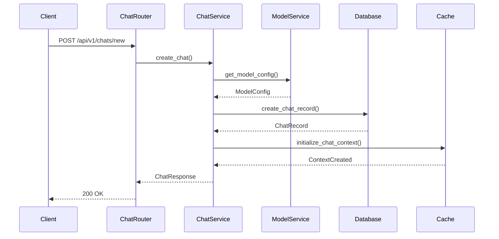
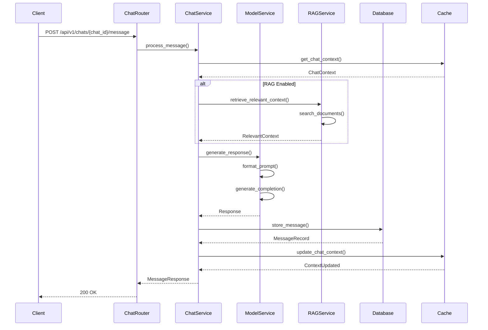
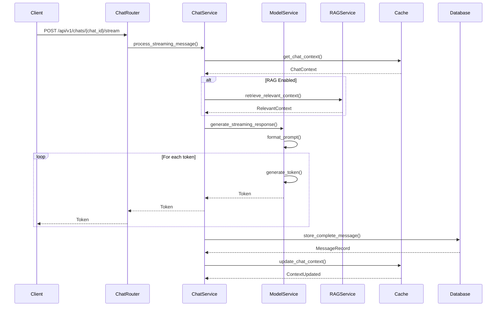
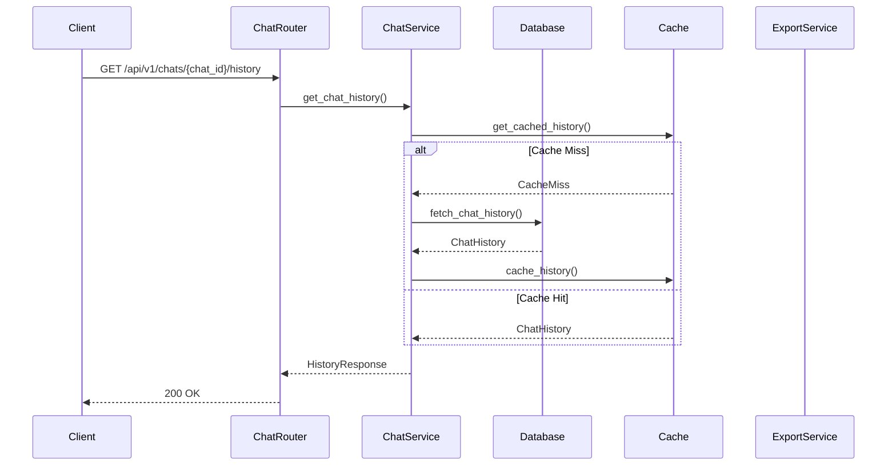

# Chat Processing Sequence Diagrams

This document provides detailed sequence diagrams for the chat processing system's key operations.

## 1. Chat Creation Flow

## 2. Message Processing Flow

## 3. Streaming Response Flow

## 4. Chat History Management Flow

## Component Interactions

### 1. Chat Management
- Chat creation
- Context initialization
- History tracking
- State management

### 2. Message Processing
- Context retrieval
- RAG integration
- Model interaction
- Response generation

### 3. Streaming
- Token generation
- Real-time updates
- Context maintenance
- State persistence

### 4. History Management
- History retrieval
- Caching
- Export functionality
- State restoration

## Error Handling

1. **Chat Creation Errors**
   - Invalid configuration
   - Resource constraints
   - Context initialization failed
   - Database errors

2. **Message Processing Errors**
   - Context retrieval failed
   - RAG search failed
   - Model errors
   - Response generation failed

3. **Streaming Errors**
   - Connection issues
   - Token generation failed
   - State corruption
   - Timeout errors

4. **History Management Errors**
   - Cache errors
   - Database errors
   - Export failures
   - State restoration failed 