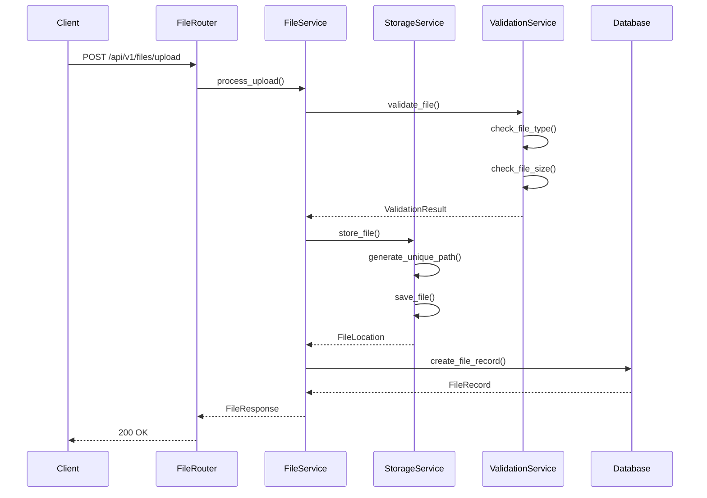
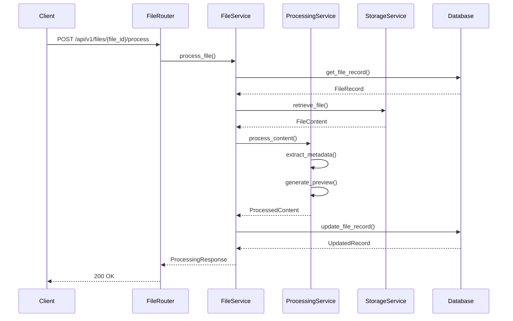
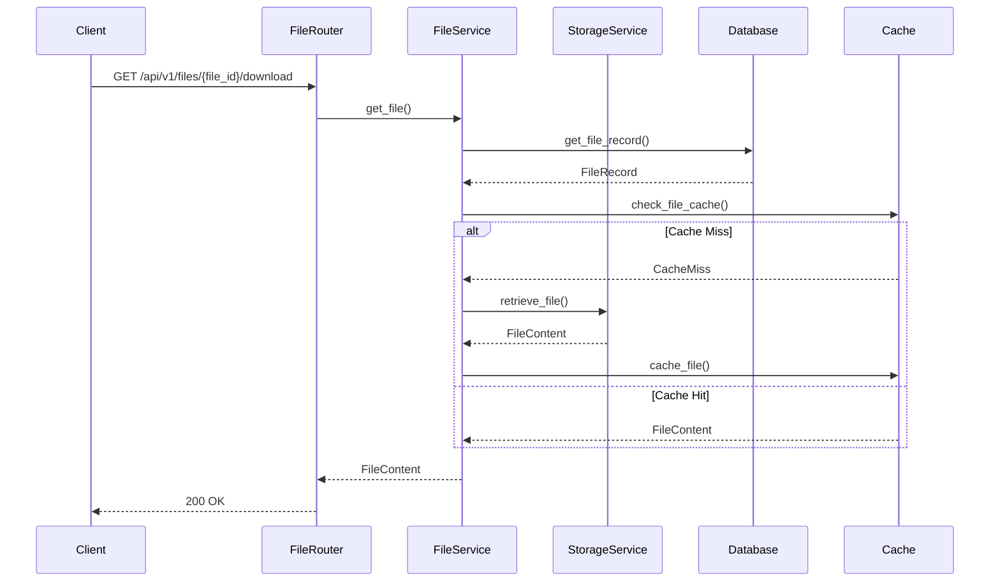
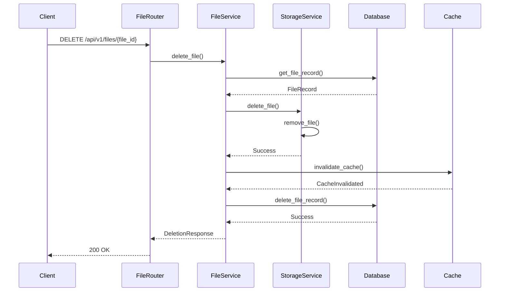

# File Management Sequence Diagrams

This document provides detailed sequence diagrams for the file management system's key operations.

## 1. File Upload Flow

## 2. File Processing Flow

## 3. File Download Flow

## 4. File Deletion Flow

## Component Interactions

### 1. File Upload
- File validation
- Storage management
- Database record creation
- Error handling

### 2. File Processing
- Content extraction
- Metadata generation
- Preview creation
- Record updates

### 3. File Download
- Cache management
- Storage retrieval
- Content delivery
- Access control

### 4. File Deletion
- Storage cleanup
- Cache invalidation
- Database cleanup
- Resource release

## Error Handling

1. **Upload Errors**
   - File size exceeded
   - Invalid file type
   - Storage full
   - Upload interrupted

2. **Processing Errors**
   - Content extraction failed
   - Preview generation failed
   - Metadata extraction failed
   - Processing timeout

3. **Download Errors**
   - File not found
   - Access denied
   - Storage error
   - Cache error

4. **Deletion Errors**
   - File locked
   - Storage error
   - Database error
   - Cache error 