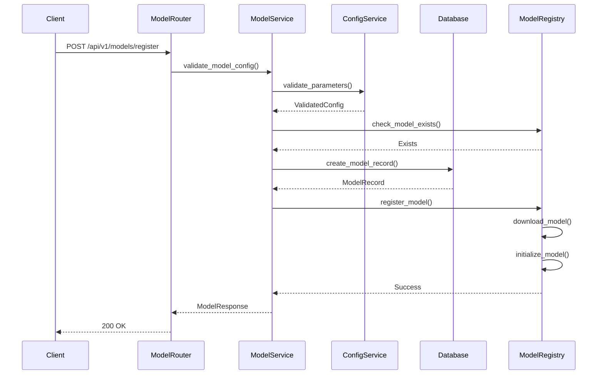
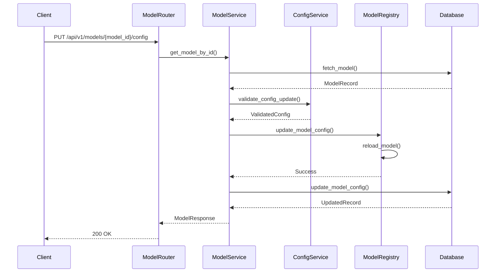
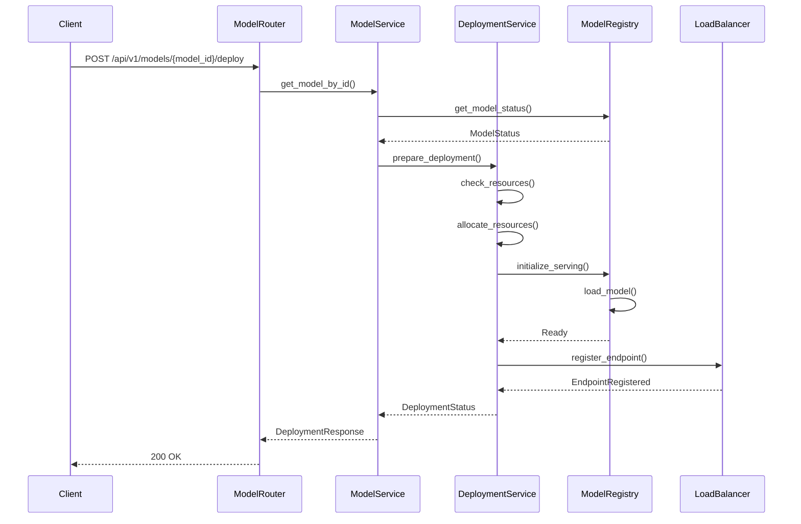
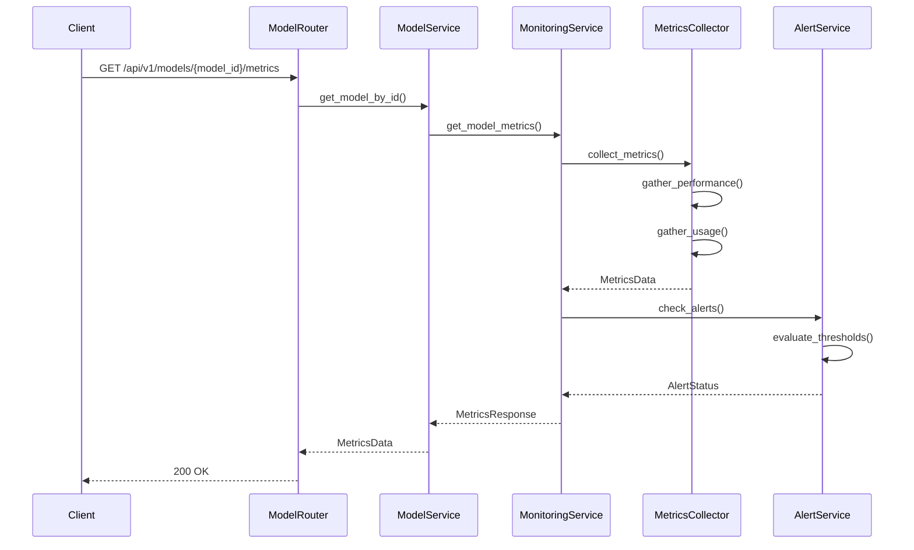

# Model Management Sequence Diagrams

This document provides detailed sequence diagrams for the model management system's key operations.

## 1. Model Registration Flow

## 2. Model Configuration Update Flow

## 3. Model Deployment Flow

## 4. Model Monitoring Flow

## Component Interactions

### 1. Model Registration
- Configuration validation
- Model existence check
- Database record creation
- Model initialization

### 2. Configuration Management
- Parameter validation
- Model reloading
- Database updates
- Configuration persistence

### 3. Model Deployment
- Resource allocation
- Model serving
- Load balancing
- Endpoint registration

### 4. Model Monitoring
- Performance metrics
- Usage statistics
- Alert management
- Health checks

## Error Handling

1. **Registration Errors**
   - Invalid configuration
   - Model already exists
   - Resource constraints
   - Download failures

2. **Configuration Errors**
   - Invalid parameters
   - Update conflicts
   - Reload failures
   - Validation errors

3. **Deployment Errors**
   - Resource allocation failed
   - Model loading failed
   - Endpoint registration failed
   - Health check failures

4. **Monitoring Errors**
   - Metrics collection failed
   - Alert processing failed
   - Data aggregation errors
   - Threshold violations 