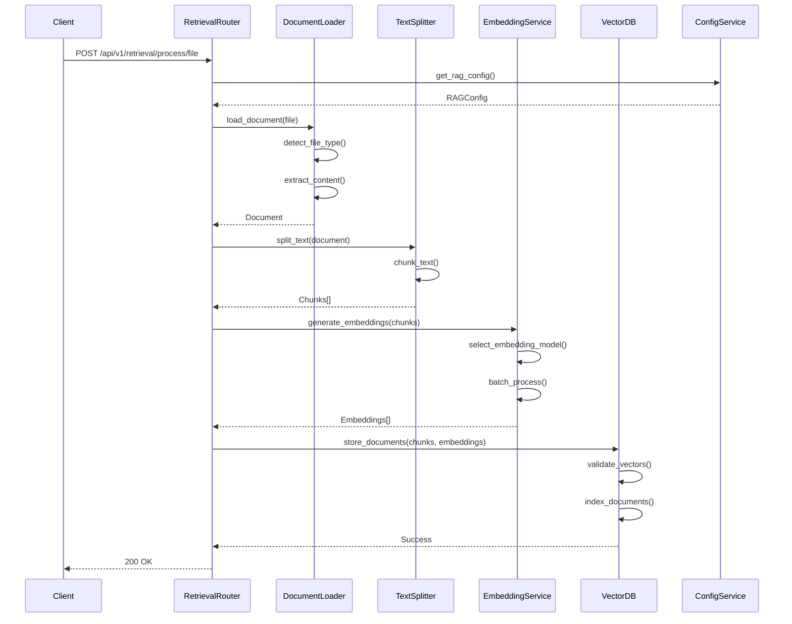
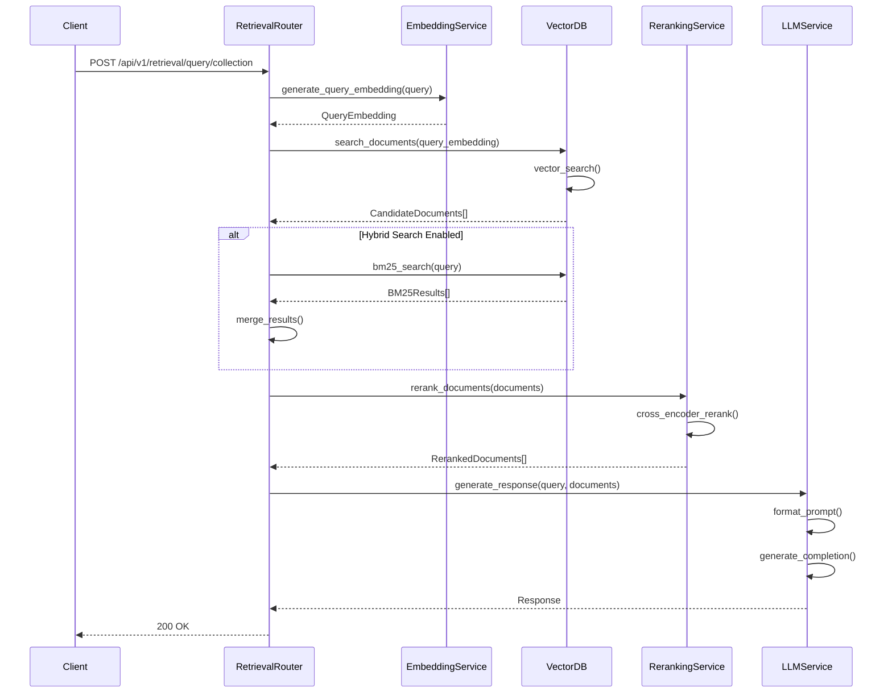
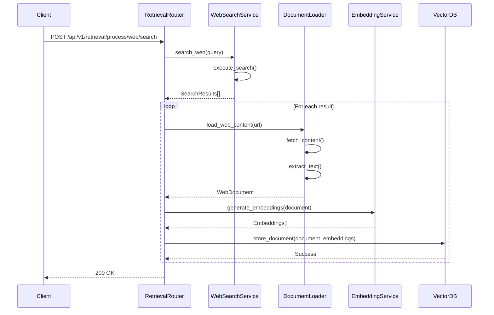
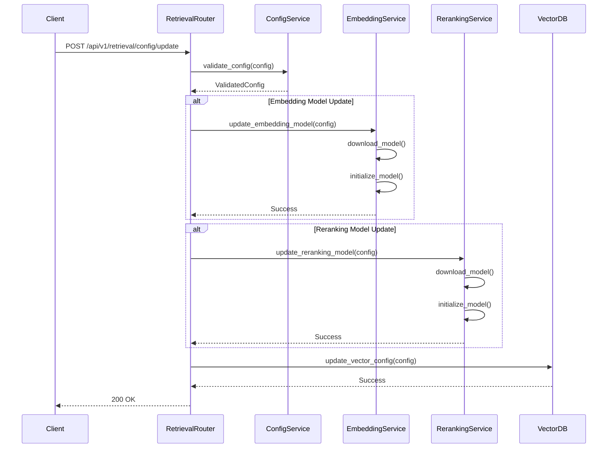

# RAG System Sequence Diagrams

This document provides detailed sequence diagrams for the RAG (Retrieval-Augmented Generation) system's key operations.

## 1. Document Ingestion Flow

## 2. Query Processing Flow

## 3. Web Search Integration Flow

## 4. Configuration Update Flow

## Component Interactions

### 1. Document Processing
- File type detection
- Content extraction
- Text chunking
- Embedding generation
- Vector storage

### 2. Query Processing
- Query embedding
- Vector search
- Hybrid search (optional)
- Reranking
- Response generation

### 3. Web Search
- Search execution
- Content fetching
- Text extraction
- Document processing
- Vector storage

### 4. Configuration Management
- Model updates
- Parameter validation
- Service reinitialization
- Vector store configuration

## Error Handling

1. **Document Processing Errors**
   - File type unsupported
   - Content extraction failed
   - Chunking errors
   - Embedding generation failed

2. **Query Processing Errors**
   - Invalid query
   - Search failed
   - Reranking errors
   - Response generation failed

3. **Web Search Errors**
   - Search API errors
   - Content fetch failed
   - Processing errors
   - Storage errors

4. **Configuration Errors**
   - Invalid parameters
   - Model download failed
   - Initialization errors
   - Storage configuration errors 