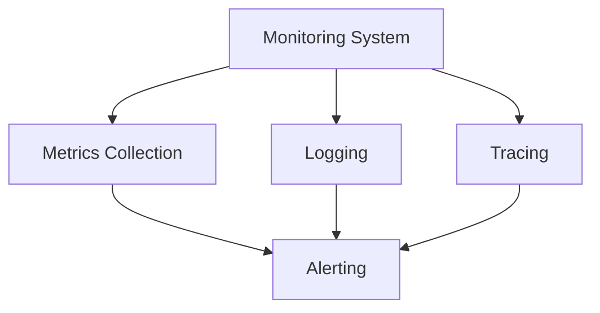

# Monitoring Documentation

This directory contains documentation for monitoring and performance in the Open WebUI backend.

## Contents

### Monitoring Architecture
- [Monitoring and Observability](monitoring_observability.md) - Monitoring setup and implementation
- [Performance Optimization](performance_optimization.md) - Performance tuning and optimization
- [Error Handling](error_handling.md) - Error management and handling

## Related Documentation
- See [deployment/README.md](../deployment/README.md) for deployment monitoring
- See [testing/README.md](../testing/README.md) for monitoring testing
- See [security/README.md](../security/README.md) for security monitoring

## Monitoring Overview

## Key Concepts
- Metrics Collection
- Logging
- Distributed Tracing
- Performance Monitoring
- Error Tracking
- Alert Management

## Last Updated
- Monitoring and Observability: 2024-03-21
- Performance Optimization: 2024-03-21
- Error Handling: 2024-03-21 