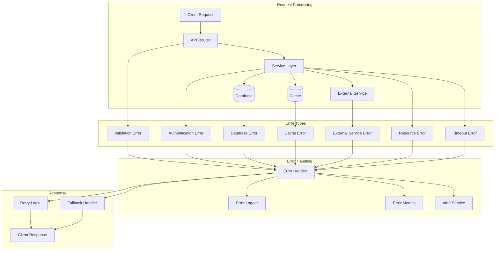
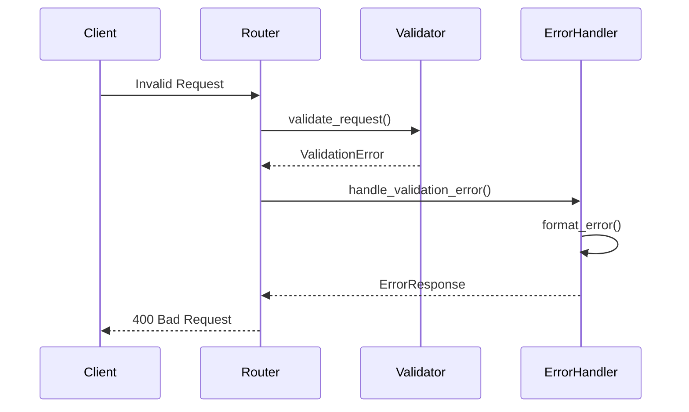
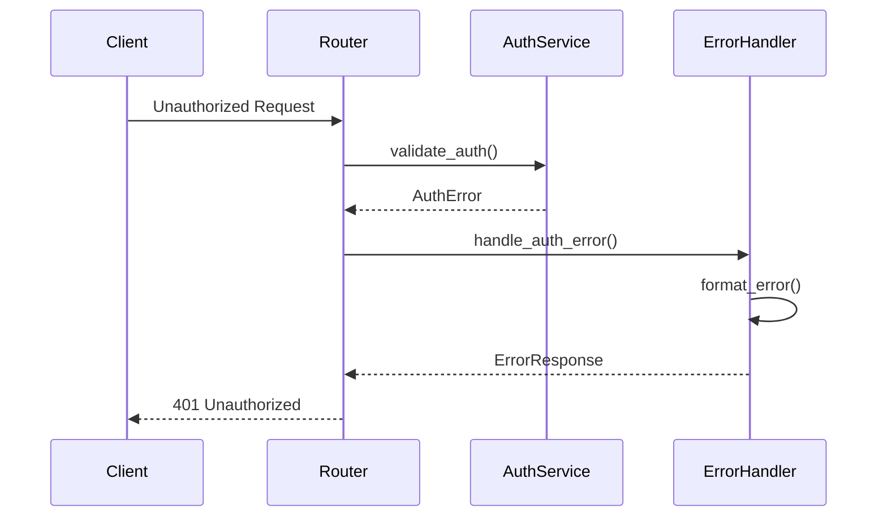
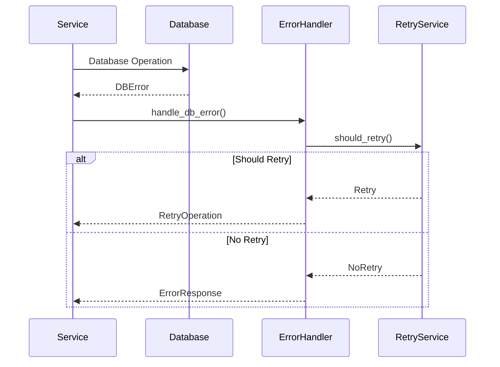
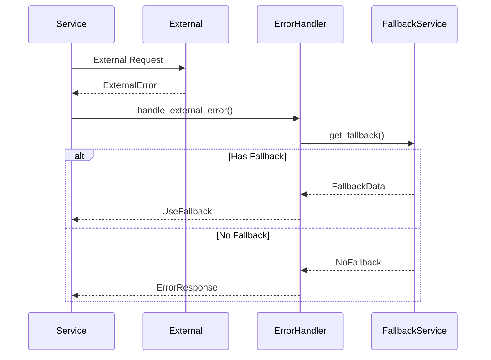

# Error Handling Architecture

This document provides a comprehensive overview of the error handling system in the Open WebUI backend.

## Error Handling Flow Diagram



## Error Categories

### 1. Validation Errors


### 2. Authentication Errors


### 3. Database Errors


### 4. External Service Errors


## Error Response Format

```json
{
    "error": {
        "code": "ERROR_CODE",
        "message": "Human readable error message",
        "details": {
            "field": "Specific field with error",
            "reason": "Detailed error reason"
        },
        "timestamp": "2024-03-21T10:00:00Z",
        "request_id": "unique-request-id"
    }
}
```

## Error Handling Strategies

### 1. Validation Errors
- Input validation
- Schema validation
- Business rule validation
- Custom validation

### 2. Authentication Errors
- Token validation
- Permission checks
- Rate limiting
- Session management

### 3. Database Errors
- Connection errors
- Query errors
- Transaction errors
- Deadlock handling

### 4. Cache Errors
- Cache misses
- Cache invalidation
- Cache consistency
- Cache warming

### 5. External Service Errors
- Timeout handling
- Circuit breaking
- Retry logic
- Fallback mechanisms

### 6. Resource Errors
- Memory management
- CPU utilization
- Network issues
- Storage limits

## Error Monitoring

### 1. Logging
- Error details
- Stack traces
- Context information
- Request/Response data

### 2. Metrics
- Error rates
- Error types
- Response times
- Resource usage

### 3. Alerts
- Error thresholds
- Service degradation
- Resource exhaustion
- Security incidents

## Best Practices

1. **Error Prevention**
   - Input validation
   - Resource monitoring
   - Rate limiting
   - Circuit breaking

2. **Error Detection**
   - Comprehensive logging
   - Real-time monitoring
   - Alert thresholds
   - Health checks

3. **Error Recovery**
   - Retry mechanisms
   - Fallback strategies
   - Graceful degradation
   - State recovery

4. **Error Communication**
   - Clear error messages
   - Proper status codes
   - Detailed error info
   - Request tracking 