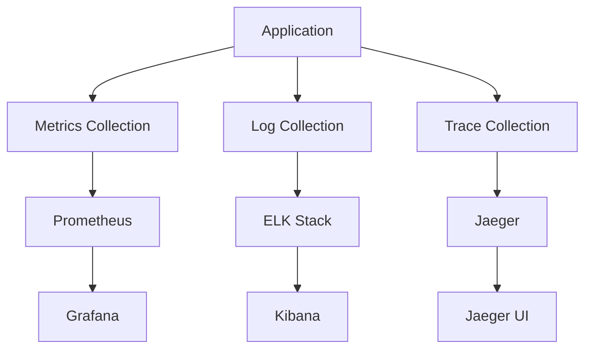

# Monitoring and Observability Documentation

This document provides comprehensive documentation for the monitoring and observability setup of the Open WebUI backend system.

## Monitoring Overview

### System Architecture


## Metrics Collection

### 1. Prometheus Configuration
```yaml
apiVersion: monitoring.coreos.com/v1
kind: ServiceMonitor
metadata:
  name: open-webui-backend
spec:
  selector:
    matchLabels:
      app: open-webui-backend
  endpoints:
  - port: metrics
    interval: 15s
    path: /metrics
```

### 2. Custom Metrics
```python
class MetricsCollector:
    def __init__(self):
        self.metrics = {
            "request_count": Counter(
                "http_requests_total",
                "Total HTTP requests",
                ["method", "endpoint", "status"]
            ),
            "request_duration": Histogram(
                "http_request_duration_seconds",
                "HTTP request duration",
                ["method", "endpoint"]
            ),
            "active_users": Gauge(
                "active_users_total",
                "Total active users"
            ),
            "error_count": Counter(
                "error_total",
                "Total errors",
                ["type"]
            )
        }
        
    async def record_request(
        self,
        method: str,
        endpoint: str,
        status: int,
        duration: float
    ) -> None:
        """Record request metrics."""
        self.metrics["request_count"].labels(
            method=method,
            endpoint=endpoint,
            status=status
        ).inc()
        
        self.metrics["request_duration"].labels(
            method=method,
            endpoint=endpoint
        ).observe(duration)
```

## Logging

### 1. Log Collection
```python
class LogCollector:
    def __init__(self):
        self.logger = logging.getLogger("open-webui")
        self.logger.setLevel(logging.INFO)
        
        # File handler
        file_handler = RotatingFileHandler(
            "/var/log/app.log",
            maxBytes=10485760,  # 10MB
            backupCount=5
        )
        file_handler.setFormatter(
            logging.Formatter(
                "%(asctime)s - %(name)s - %(levelname)s - %(message)s"
            )
        )
        
        # Elasticsearch handler
        es_handler = ElasticsearchHandler(
            host="elasticsearch:9200",
            index="app-logs"
        )
        
        self.logger.addHandler(file_handler)
        self.logger.addHandler(es_handler)
        
    async def log_event(
        self,
        level: str,
        message: str,
        extra: Dict[str, Any] = None
    ) -> None:
        """Log event with additional context."""
        log_method = getattr(self.logger, level.lower())
        log_method(message, extra=extra or {})
```

### 2. Structured Logging
```python
class StructuredLogger:
    def __init__(self):
        self.logger = logging.getLogger("open-webui")
        
    async def log_request(
        self,
        request_id: str,
        method: str,
        endpoint: str,
        status: int,
        duration: float
    ) -> None:
        """Log request details in structured format."""
        await self.logger.info(
            "HTTP Request",
            extra={
                "request_id": request_id,
                "method": method,
                "endpoint": endpoint,
                "status": status,
                "duration": duration,
                "timestamp": datetime.utcnow().isoformat()
            }
        )
```

## Distributed Tracing

### 1. Jaeger Configuration
```yaml
apiVersion: jaegertracing.io/v1
kind: Jaeger
metadata:
  name: jaeger
spec:
  strategy: production
  storage:
    type: elasticsearch
    options:
      es:
        server-urls: http://elasticsearch:9200
  ingress:
    enabled: true
    annotations:
      kubernetes.io/ingress.class: nginx
```

### 2. Trace Collection
```python
class TraceCollector:
    def __init__(self):
        self.tracer = opentracing.global_tracer()
        
    async def start_span(
        self,
        operation_name: str,
        context: Dict[str, Any] = None
    ) -> Span:
        """Start a new trace span."""
        span = self.tracer.start_span(operation_name)
        
        if context:
            for key, value in context.items():
                span.set_tag(key, value)
                
        return span
        
    async def finish_span(
        self,
        span: Span,
        error: Exception = None
    ) -> None:
        """Finish a trace span."""
        if error:
            span.set_tag("error", True)
            span.log_kv({
                "event": "error",
                "error.kind": type(error).__name__,
                "error.object": str(error)
            })
        span.finish()
```

## Alerting

### 1. Alert Rules
```yaml
groups:
- name: open-webui
  rules:
  - alert: HighErrorRate
    expr: rate(error_total[5m]) > 0.1
    for: 5m
    labels:
      severity: critical
    annotations:
      summary: High error rate detected
      description: Error rate is above 10% for 5 minutes
      
  - alert: HighLatency
    expr: histogram_quantile(0.95, rate(http_request_duration_seconds_bucket[5m])) > 1
    for: 5m
    labels:
      severity: warning
    annotations:
      summary: High latency detected
      description: 95th percentile latency is above 1 second
```

### 2. Alert Manager
```python
class AlertManager:
    def __init__(self, alert_service: AlertService):
        self.alert_service = alert_service
        self.thresholds = {
            "error_rate": 0.1,
            "latency": 1.0,
            "cpu_usage": 80,
            "memory_usage": 80
        }
        
    async def check_metrics(
        self,
        metrics: Dict[str, float]
    ) -> List[Alert]:
        """Check metrics against thresholds."""
        alerts = []
        for metric, value in metrics.items():
            if metric in self.thresholds:
                threshold = self.thresholds[metric]
                if value > threshold:
                    alerts.append(
                        await self.alert_service.create_alert(
                            metric,
                            value,
                            threshold
                        )
                    )
        return alerts
```

## Dashboard Configuration

### 1. Grafana Dashboards
```json
{
  "dashboard": {
    "id": null,
    "title": "Open WebUI Backend",
    "panels": [
      {
        "title": "Request Rate",
        "type": "graph",
        "datasource": "Prometheus",
        "targets": [
          {
            "expr": "rate(http_requests_total[5m])",
            "legendFormat": "{{method}} {{endpoint}}"
          }
        ]
      },
      {
        "title": "Error Rate",
        "type": "graph",
        "datasource": "Prometheus",
        "targets": [
          {
            "expr": "rate(error_total[5m])",
            "legendFormat": "{{type}}"
          }
        ]
      }
    ]
  }
}
```

### 2. Kibana Dashboards
```json
{
  "dashboard": {
    "title": "Application Logs",
    "panels": [
      {
        "title": "Log Volume",
        "type": "line",
        "query": {
          "query": "*",
          "time": {
            "from": "now-24h",
            "to": "now"
          }
        }
      },
      {
        "title": "Error Distribution",
        "type": "pie",
        "query": {
          "query": "level: ERROR",
          "time": {
            "from": "now-24h",
            "to": "now"
          }
        }
      }
    ]
  }
}
```

## Best Practices

### 1. Metrics
- Use appropriate metric types
- Implement proper labeling
- Set appropriate collection intervals
- Implement proper aggregation
- Use proper naming conventions

### 2. Logging
- Use structured logging
- Implement proper log levels
- Set appropriate retention
- Implement proper rotation
- Use proper formatting

### 3. Tracing
- Implement proper sampling
- Use appropriate span types
- Set proper context
- Implement proper propagation
- Use proper naming

### 4. Alerting
- Set appropriate thresholds
- Implement proper escalation
- Use proper severity levels
- Implement proper routing
- Use proper templates

### 5. Dashboards
- Create meaningful visualizations
- Implement proper organization
- Use appropriate time ranges
- Implement proper refresh rates
- Use proper annotations

### 6. General
- Implement proper correlation
- Use proper retention policies
- Implement proper access control
- Use proper data protection
- Implement proper scaling 