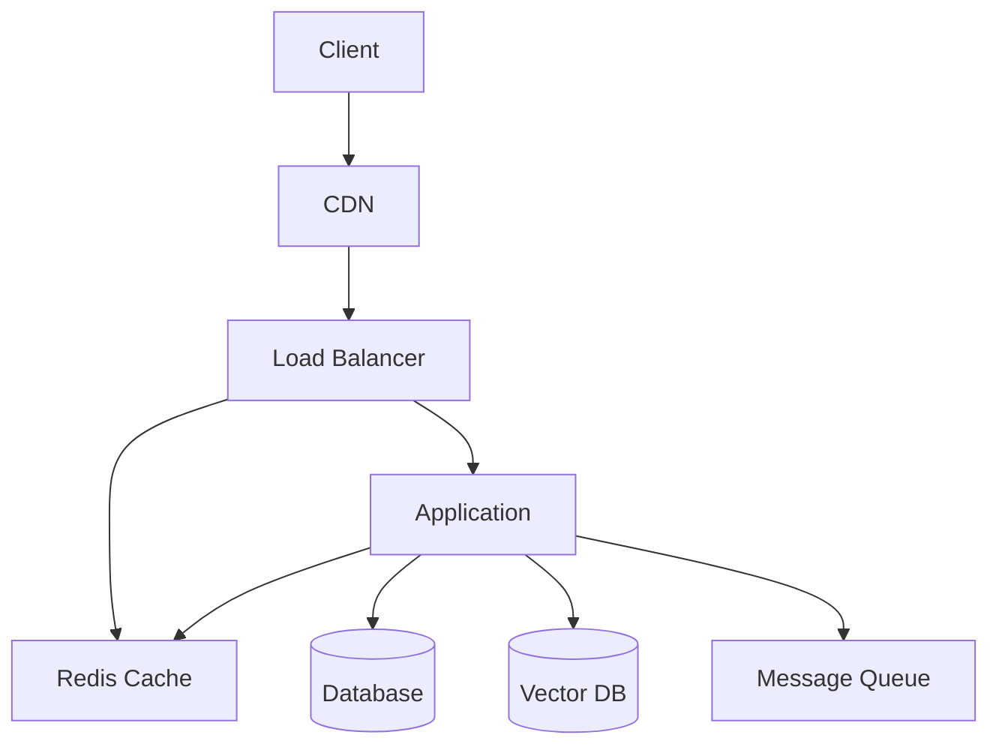

# Performance Optimization Documentation

This document provides comprehensive documentation for performance optimization in the Open WebUI backend system.

## Performance Overview

### System Architecture


## Caching Strategy

### 1. Redis Cache Configuration
```python
class CacheManager:
    def __init__(self, redis_client: Redis):
        self.redis = redis_client
        self.default_ttl = 3600  # 1 hour
        self.cache_patterns = {
            "user": "user:{user_id}",
            "chat": "chat:{chat_id}",
            "model": "model:{model_id}",
            "document": "document:{doc_id}"
        }
        
    async def get_cached(
        self,
        pattern: str,
        key: str,
        ttl: int = None
    ) -> Optional[Any]:
        """Get cached data with pattern."""
        cache_key = pattern.format(**{"key": key})
        data = await self.redis.get(cache_key)
        
        if data:
            return json.loads(data)
            
        return None
        
    async def set_cached(
        self,
        pattern: str,
        key: str,
        data: Any,
        ttl: int = None
    ) -> None:
        """Set cached data with pattern."""
        cache_key = pattern.format(**{"key": key})
        await self.redis.setex(
            cache_key,
            ttl or self.default_ttl,
            json.dumps(data)
        )
```

### 2. Cache Invalidation
```python
class CacheInvalidator:
    def __init__(self, redis_client: Redis):
        self.redis = redis_client
        self.invalidation_patterns = {
            "user": ["user:{user_id}", "user_list"],
            "chat": ["chat:{chat_id}", "chat_list:{user_id}"],
            "document": ["document:{doc_id}", "document_list"]
        }
        
    async def invalidate(
        self,
        pattern: str,
        key: str
    ) -> None:
        """Invalidate cache by pattern."""
        if pattern in self.invalidation_patterns:
            for cache_pattern in self.invalidation_patterns[pattern]:
                cache_key = cache_pattern.format(**{"key": key})
                await self.redis.delete(cache_key)
```

## Database Optimization

### 1. Query Optimization
```python
class QueryOptimizer:
    def __init__(self):
        self.query_cache = {}
        
    async def optimize_query(
        self,
        query: str,
        params: Dict[str, Any]
    ) -> str:
        """Optimize database query."""
        # Add query hints
        query = self.add_query_hints(query)
        
        # Add proper indexes
        query = self.add_index_hints(query)
        
        # Optimize joins
        query = self.optimize_joins(query)
        
        return query
        
    def add_query_hints(self, query: str) -> str:
        """Add query optimization hints."""
        if "SELECT" in query.upper():
            return query.replace(
                "SELECT",
                "SELECT /*+ USE_INDEX(table idx_name) */"
            )
        return query
```

### 2. Connection Pooling
```python
class DatabasePool:
    def __init__(self):
        self.pool = AsyncIOMotorClient(
            host="mongodb://localhost:27017",
            maxPoolSize=50,
            minPoolSize=10,
            maxIdleTimeMS=30000,
            waitQueueTimeoutMS=10000
        )
        
    async def get_connection(self) -> AsyncIOMotorClient:
        """Get database connection from pool."""
        return self.pool
        
    async def release_connection(self, conn: AsyncIOMotorClient) -> None:
        """Release connection back to pool."""
        # Connection is automatically released
        pass
```

## Load Balancing

### 1. Load Balancer Configuration
```python
class LoadBalancer:
    def __init__(self):
        self.algorithm = "least_connections"
        self.health_check = {
            "path": "/health",
            "interval": 30,
            "timeout": 5,
            "healthy_threshold": 2,
            "unhealthy_threshold": 2
        }
        self.backends = []
        
    async def add_backend(
        self,
        backend: str,
        weight: int = 1
    ) -> None:
        """Add backend server."""
        self.backends.append({
            "url": backend,
            "weight": weight,
            "connections": 0,
            "healthy": True
        })
        
    async def get_backend(self) -> str:
        """Get least loaded backend."""
        healthy_backends = [
            b for b in self.backends
            if b["healthy"]
        ]
        
        if not healthy_backends:
            raise NoHealthyBackendsError()
            
        return min(
            healthy_backends,
            key=lambda x: x["connections"]
        )["url"]
```

### 2. Health Checking
```python
class HealthChecker:
    def __init__(self, backends: List[str]):
        self.backends = backends
        self.client = AsyncHTTPClient()
        
    async def check_health(self) -> Dict[str, bool]:
        """Check health of all backends."""
        results = {}
        for backend in self.backends:
            try:
                response = await self.client.get(
                    f"{backend}/health",
                    timeout=5
                )
                results[backend] = response.status_code == 200
            except Exception:
                results[backend] = False
        return results
```

## Message Queue

### 1. Queue Configuration
```python
class MessageQueue:
    def __init__(self):
        self.connection = AsyncRabbitMQ(
            host="localhost",
            port=5672,
            username="guest",
            password="guest"
        )
        self.queues = {
            "chat": "chat_queue",
            "document": "document_queue",
            "notification": "notification_queue"
        }
        
    async def publish(
        self,
        queue: str,
        message: Dict[str, Any]
    ) -> None:
        """Publish message to queue."""
        if queue not in self.queues:
            raise InvalidQueueError(queue)
            
        await self.connection.publish(
            exchange="",
            routing_key=self.queues[queue],
            body=json.dumps(message)
        )
```

### 2. Queue Consumer
```python
class QueueConsumer:
    def __init__(self, queue: str):
        self.queue = queue
        self.handlers = {
            "chat": self.handle_chat,
            "document": self.handle_document,
            "notification": self.handle_notification
        }
        
    async def consume(self) -> None:
        """Consume messages from queue."""
        async for message in self.queue.consume():
            try:
                data = json.loads(message.body)
                handler = self.handlers.get(data["type"])
                if handler:
                    await handler(data)
                await message.ack()
            except Exception as e:
                await message.reject()
                await self.log_error(e)
```

## CDN Integration

### 1. CDN Configuration
```python
class CDNManager:
    def __init__(self):
        self.cdn_url = "https://cdn.openwebui.com"
        self.cache_control = {
            "static": "public, max-age=31536000",
            "dynamic": "public, max-age=3600",
            "api": "no-cache"
        }
        
    def get_cdn_url(self, path: str) -> str:
        """Get CDN URL for resource."""
        return f"{self.cdn_url}/{path.lstrip('/')}"
        
    def get_cache_control(
        self,
        content_type: str
    ) -> str:
        """Get cache control header."""
        if content_type.startswith("image/"):
            return self.cache_control["static"]
        elif content_type == "application/json":
            return self.cache_control["api"]
        return self.cache_control["dynamic"]
```

### 2. Asset Optimization
```python
class AssetOptimizer:
    def __init__(self):
        self.optimizers = {
            "js": self.optimize_js,
            "css": self.optimize_css,
            "image": self.optimize_image
        }
        
    async def optimize_asset(
        self,
        asset_type: str,
        content: bytes
    ) -> bytes:
        """Optimize asset content."""
        if asset_type in self.optimizers:
            return await self.optimizers[asset_type](content)
        return content
        
    async def optimize_js(self, content: bytes) -> bytes:
        """Optimize JavaScript content."""
        # Implement JS optimization
        return content
```

## Best Practices

### 1. Caching
- Use appropriate cache strategies
- Implement proper invalidation
- Set appropriate TTLs
- Use cache patterns
- Monitor cache hit rates

### 2. Database
- Use proper indexing
- Optimize queries
- Implement connection pooling
- Use proper schemas
- Monitor query performance

### 3. Load Balancing
- Use appropriate algorithms
- Implement health checks
- Monitor backend health
- Use proper weights
- Implement failover

### 4. Message Queue
- Use appropriate queues
- Implement proper routing
- Handle failures gracefully
- Monitor queue health
- Use proper acknowledgments

### 5. CDN
- Use proper caching
- Implement proper headers
- Optimize assets
- Monitor CDN health
- Use proper origins

### 6. General
- Monitor system metrics
- Implement proper logging
- Use proper monitoring
- Implement proper alerts
- Use proper scaling 