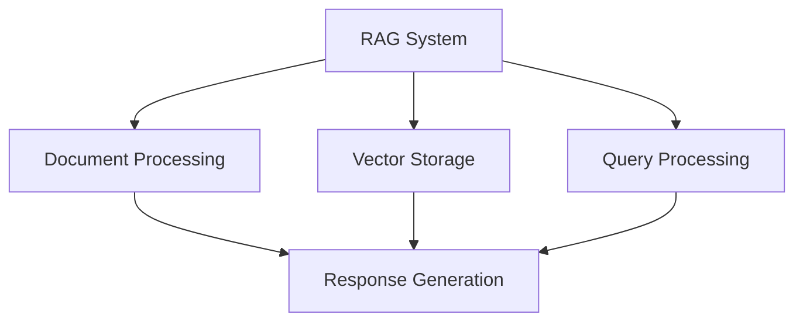

# RAG System Documentation

This directory contains documentation for the Retrieval-Augmented Generation (RAG) system in the Open WebUI backend.

## Contents

### RAG Architecture
- [RAG Logic](rag_logic.md) - RAG implementation details and architecture

## Related Documentation
- See [data/README.md](../data/README.md) for data management
- See [diagrams/README.md](../diagrams/README.md) for RAG flow diagrams
- See [components/README.md](../components/README.md) for RAG components

## RAG Overview

## Key Concepts
- Document Processing
- Vector Storage
- Query Processing
- Response Generation
- RAG Architecture
- Performance Optimization

## Last Updated
- RAG Logic: 2024-03-21 