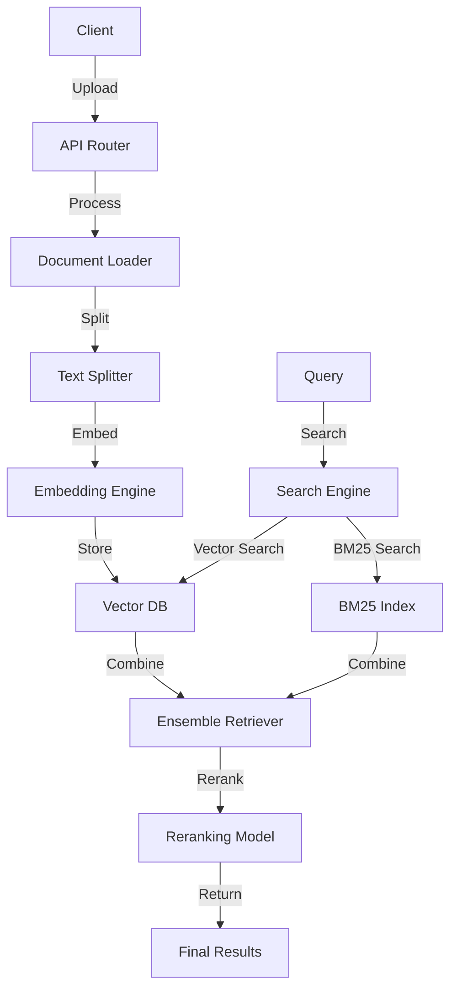

# RAG Logic Architecture

This document describes the architecture and workflow of the Retrieval-Augmented Generation (RAG) system within the `oui-backend`, primarily located in the `open_webui/retrieval/` directory and orchestrated by `open_webui/routers/retrieval.py`.

## Core Components

1.  **Configuration (`open_webui/config.py`, `routers/retrieval.py`):**
    *   Defines crucial parameters for the RAG pipeline:
        *   Vector database type (`VECTOR_DB`).
        *   Embedding engine and model (`RAG_EMBEDDING_ENGINE`, `RAG_EMBEDDING_MODEL`).
        *   Reranking model (`RAG_RERANKING_MODEL`).
        *   Text splitting parameters (`CHUNK_SIZE`, `CHUNK_OVERLAP`, `RAG_TEXT_SPLITTER`).
        *   Retrieval parameters (`RAG_TOP_K`, `RAG_RELEVANCE_THRESHOLD`).
        *   Document loading engine (`CONTENT_EXTRACTION_ENGINE` - e.g., 'default', 'tika', 'document_intelligence').
        *   Web search engine settings and API keys.
    *   Configuration values are loaded into `app.state` and accessed throughout the RAG modules.
    *   Admin endpoints in `routers/retrieval.py` allow viewing and updating some of these settings.

2.  **Vector Database Abstraction (`open_webui/retrieval/vector/`):**
    *   `connector.py`: Acts as a factory, selecting the appropriate vector database client based on the `VECTOR_DB` config value.
    *   `dbs/`: Contains specific client implementations for supported databases (Chroma, Milvus, Qdrant, OpenSearch, Pgvector, Elasticsearch).
    *   `VECTOR_DB_CLIENT`: The instantiated client object, providing a consistent interface for adding, searching, getting, and deleting data in the chosen vector store. Used by `retrieval/utils.py`.

3.  **Document Loading (`open_webui/retrieval/loaders/`):**
    *   `main.py`: Defines the central `Loader` class.
    *   It selects a document loading strategy based on file type (`.pdf`, `.docx`, `.md`, etc.), content type, and the configured `CONTENT_EXTRACTION_ENGINE`.
    *   Leverages various `langchain_community.document_loaders` (e.g., `PyPDFLoader`, `Docx2txtLoader`, `TextLoader`) for standard file types.
    *   Can optionally use external services like Apache Tika (`TikaLoader`) or Azure AI Document Intelligence (`AzureAIDocumentIntelligenceLoader`) via configuration.
    *   Applies text cleaning using `ftfy.fix_text`.
    *   Specific loaders like `youtube.py` handle non-file sources.

4.  **Core Retrieval Utilities (`open_webui/retrieval/utils.py`):**
    *   Contains functions for embedding generation (`generate_embeddings`, `get_embedding_function`) supporting different engines (local SentenceTransformers, OpenAI, Ollama).
    *   Provides functions for querying the vector store (`query_doc`, `query_collection`) using `VECTOR_DB_CLIENT`.
    *   Implements hybrid search (`query_doc_with_hybrid_search`, `query_collection_with_hybrid_search`) using LangChain's `EnsembleRetriever` (combining vector search and `BM25Retriever`).
    *   Integrates reranking using LangChain's `ContextualCompressionRetriever` with a custom compressor (likely wrapping a `sentence_transformers.CrossEncoder` or custom models like ColBERT).
    *   Includes helpers for model downloading (`get_model_path`) and result processing (merging, sorting, deduplication).

5.  **Web Search Integration (`open_webui/retrieval/web/`):**
    *   Contains modules (`google_pse.py`, `bing.py`, `tavily.py`, etc.) for querying various configured web search engines.
    *   Results are processed into a standard format (`SearchResult`).
    *   Web content can be fetched using loaders (`get_web_loader`).

6.  **API Orchestration (`open_webui/routers/retrieval.py`):**
    *   Defines the API endpoints (`/api/v1/retrieval/...`).
    *   `/process/*` endpoints orchestrate the ingestion pipeline.
    *   `/query/*` endpoints orchestrate the querying pipeline.
    *   `/config/*`, `/embedding/*`, `/reranking/*` endpoints manage RAG configuration.
    *   `/delete`, `/reset/*` endpoints manage data within the RAG system.

## Workflows

### Ingestion Pipeline (e.g., File Upload via `/process/file`)

1.  File is uploaded via the API endpoint.
2.  The `Loader` (`loaders/main.py`) selects the appropriate mechanism to load the file content into LangChain `Document` objects.
3.  Text splitters (`RecursiveCharacterTextSplitter` or `TokenTextSplitter`) divide the documents into chunks based on configuration (`CHUNK_SIZE`, `CHUNK_OVERLAP`).
4.  Embeddings are generated for each chunk using the configured embedding function (`retrieval/utils.py`).
5.  The chunks (content, metadata, embeddings) are added to the specified collection in the vector database using `VECTOR_DB_CLIENT.add()`.

### Querying Pipeline (e.g., `/query/collection`)

1.  A query string is received by the API endpoint.
2.  An embedding is generated for the query string.
3.  The appropriate query function (`query_collection` or `query_collection_with_hybrid_search`) from `retrieval/utils.py` is called.
4.  **Vector Search:** `VECTOR_DB_CLIENT.search()` retrieves documents based on vector similarity.
5.  **(Optional) Hybrid Search:** BM25 keyword search is performed, results are combined with vector search results using `EnsembleRetriever`.
6.  **(Optional) Reranking:** The combined results are passed to a `ContextualCompressionRetriever` which uses a reranking model (CrossEncoder) to score and filter the documents based on relevance to the original query.
7.  The final list of relevant document chunks (content and metadata) is returned.

### Web Search RAG

1.  A query is sent to the `/process/web/search` endpoint (or web search is triggered within a chat flow).
2.  The configured search engine module in `retrieval/web/` is called to get search results.
3.  Optionally, content from result URLs is fetched using web loaders.
4.  This content can be directly used as context or potentially processed through the ingestion pipeline to be added to a vector collection for later retrieval.

## Best Practices and Configuration

### Context Length Considerations

:::warning
If using **Ollama**, note that it **defaults to a 2048-token context length**. This means that retrieved data may **not be used at all** because it doesn't fit within the available context window. To improve **RAG performance**, you should **increase the context length** to **8192+ tokens** in your Ollama model settings.
:::

### Document Processing

1. **Local Documents**
   - Must be uploaded via the Documents section of the Workspace area
   - Access using the `#` symbol before a query
   - Click on the formatted URL that appears above the chat box
   - A document icon appears above "Send a message" when successfully retrieved

2. **Remote Documents**
   - Load documents by starting a prompt with `#` followed by a URL
   - Helps incorporate web content directly into conversations
   - Supports various document formats and sources

### Web Search Integration

- Start queries with `#` followed by the target URL
- Click on the formatted URL in the box that appears above the chat box
- A document icon indicates successful retrieval
- Open WebUI fetches and parses information from the URL if possible

:::tip
Web pages often contain extraneous information such as navigation and footer. For better results, link to a raw or reader-friendly version of the page.
:::

### RAG Template Customization

The RAG template can be customized from the `Admin Panel` > `Settings` > `Documents` menu. The default template includes:

- Task description
- Guidelines for response generation
- Citation format specifications
- Context and query placeholders

### Embedding and Reranking Configuration

1. **Embedding Models**
   - Change the RAG embedding model in `Admin Panel` > `Settings` > `Documents`
   - Supports Ollama and OpenAI models
   - Configurable through environment variables:
     - `RAG_EMBEDDING_ENGINE`
     - `RAG_EMBEDDING_MODEL`
     - `RAG_EMBEDDING_BATCH_SIZE`

2. **Reranking**
   - Hybrid search feature with `BM25` and `CrossEncoder`
   - Configurable relevance score thresholds
   - Environment variables:
     - `ENABLE_RAG_HYBRID_SEARCH`
     - `RAG_RELEVANCE_THRESHOLD`
     - `RAG_RERANKING_MODEL`

### Citations and Source Tracking

The RAG feature includes built-in citation support:
- Tracks document context with source references
- Adds citations in the format `[source_id]`
- Ensures transparency in information sources
- Maintains accountability in responses

### Enhanced Features

1. **YouTube Integration**
   - Dedicated RAG pipeline for YouTube videos
   - Processes video transcriptions
   - Enables video content in conversations

2. **Google Drive Integration**
   - Direct access to Drive files from chat interface
   - Supports various document types
   - Requires Google Cloud project setup:
     - Google Picker API
     - Google Drive API
     - OAuth 2.0 client configuration

## Summary

The RAG system is a modular component leveraging LangChain and various external services. It abstracts the vector database interaction, provides flexible document loading, generates embeddings, performs hybrid search and reranking, and integrates web search capabilities to provide relevant context for Large Language Models. Configuration plays a key role in tailoring the pipeline's behavior.

## Technical Architecture

### Component Interaction Diagram



### Data Flow

1. **Document Ingestion**
   ```mermaid
   sequenceDiagram
       participant C as Client
       participant R as Router
       participant L as Loader
       participant S as Splitter
       participant E as Embedding
       participant V as Vector DB
       
       C->>R: Upload Document
       R->>L: Process Document
       L->>S: Split Text
       S->>E: Generate Embeddings
       E->>V: Store Vectors
       V-->>C: Confirmation
   ```

2. **Query Processing**
   ```mermaid
   sequenceDiagram
       participant C as Client
       participant R as Router
       participant E as Embedding
       participant V as Vector DB
       participant B as BM25
       participant M as Reranker
       
       C->>R: Send Query
       R->>E: Generate Query Embedding
       E->>V: Vector Search
       R->>B: BM25 Search
       V-->>M: Vector Results
       B-->>M: BM25 Results
       M->>M: Combine & Rerank
       M-->>C: Final Results
   ```

### Key Classes and Interfaces

1. **Vector Database Interface**
   ```python
   class VectorDBClient:
       def add(self, collection_name: str, documents: List[Document], embeddings: List[List[float]]) -> None
       def search(self, collection_name: str, query_embedding: List[float], limit: int = 3) -> List[Document]
       def get(self, collection_name: str, ids: List[str]) -> List[Document]
       def delete(self, collection_name: str, ids: List[str]) -> None
   ```

2. **Document Loader Interface**
   ```python
   class DocumentLoader:
       def load(self, source: str) -> List[Document]
       def load_and_split(self, source: str) -> List[Document]
   ```

3. **Embedding Function Interface**
   ```python
   class EmbeddingFunction:
       def __call__(self, text: Union[str, List[str]]) -> Union[List[float], List[List[float]]]
   ```

### Performance Considerations

1. **Batch Processing**
   - Embeddings are generated in batches for better performance
   - Vector database operations are optimized for bulk operations
   - Document splitting can be parallelized

2. **Caching Strategy**
   - Embeddings are cached to avoid recomputation
   - Vector search results are cached for similar queries
   - Document chunks are cached for repeated access

3. **Resource Management**
   - Memory usage is monitored during document processing
   - Vector database connections are pooled
   - Background tasks are used for long-running operations

### Error Handling

1. **Document Processing Errors**
   - Invalid file formats
   - Corrupted documents
   - Unsupported content types
   - Size limits exceeded

2. **Embedding Errors**
   - Model loading failures
   - API rate limits
   - Network issues
   - Invalid input

3. **Vector Database Errors**
   - Connection issues
   - Storage limits
   - Invalid operations
   - Consistency problems

### Monitoring and Logging

1. **Performance Metrics**
   - Document processing time
   - Embedding generation time
   - Search latency
   - Cache hit rates
   - Resource usage

2. **Error Tracking**
   - Processing failures
   - API errors
   - Database errors
   - Rate limit violations

3. **Usage Statistics**
   - Document counts
   - Query patterns
   - Collection sizes
   - User activity 