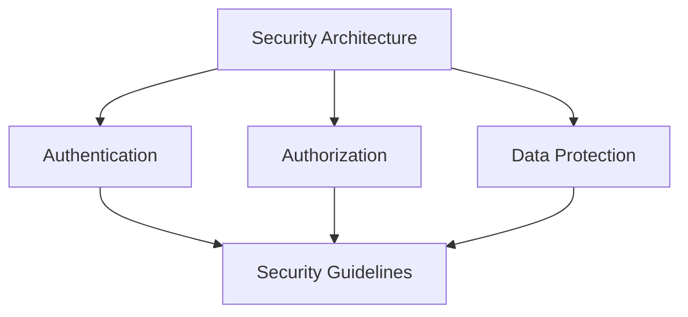

# Security Documentation

This directory contains documentation for security architecture and guidelines in the Open WebUI backend.

## Contents

### Security Architecture
- [Security Architecture](security_architecture.md) - Security design and implementation
- [Security Guidelines](security_guidelines.md) - Security best practices and standards

## Related Documentation
- See [api/README.md](../api/README.md) for API security
- See [deployment/README.md](../deployment/README.md) for deployment security
- See [monitoring/README.md](../monitoring/README.md) for security monitoring

## Security Overview

## Key Concepts
- Authentication
- Authorization
- Data Protection
- Security Monitoring
- Compliance
- Security Best Practices

## Last Updated
- Security Architecture: 2024-03-21
- Security Guidelines: 2024-03-21 