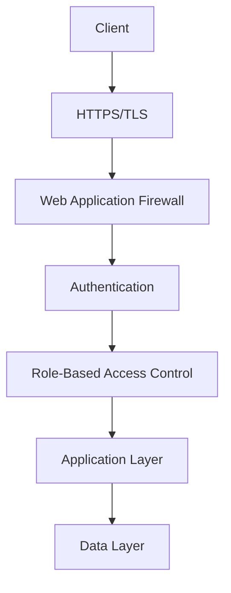

# Security Architecture Documentation

This document provides comprehensive documentation for the security architecture of the Open WebUI backend system.

## Security Overview

### Security Layers


## Authentication and Authorization

### 1. JWT Authentication
```python
class JWTAuthentication:
    def __init__(self, secret_key: str, algorithm: str = "HS256"):
        self.secret_key = secret_key
        self.algorithm = algorithm
        self.token_expiry = 3600  # 1 hour
        
    def create_token(self, user_id: str, roles: List[str]) -> str:
        """Create JWT token with claims."""
        claims = {
            "sub": user_id,
            "roles": roles,
            "exp": datetime.utcnow() + timedelta(seconds=self.token_expiry)
        }
        return jwt.encode(claims, self.secret_key, algorithm=self.algorithm)
        
    def verify_token(self, token: str) -> Dict[str, Any]:
        """Verify and decode JWT token."""
        try:
            return jwt.decode(token, self.secret_key, algorithms=[self.algorithm])
        except jwt.InvalidTokenError:
            raise AuthenticationError("Invalid token")
```

### 2. OAuth2 Integration
```python
class OAuth2Provider:
    def __init__(self, client_id: str, client_secret: str):
        self.client_id = client_id
        self.client_secret = client_secret
        self.providers = {
            "google": GoogleOAuth2,
            "github": GitHubOAuth2
        }
        
    async def authenticate(
        self,
        provider: str,
        code: str,
        redirect_uri: str
    ) -> OAuth2Response:
        """Authenticate with OAuth2 provider."""
        if provider not in self.providers:
            raise UnsupportedProviderError(provider)
            
        oauth2 = self.providers[provider](
            self.client_id,
            self.client_secret
        )
        
        return await oauth2.authenticate(code, redirect_uri)
```

## Data Protection

### 1. Encryption Service
```python
class EncryptionService:
    def __init__(self, key: bytes):
        self.key = key
        self.algorithm = "AES-256-GCM"
        
    def encrypt(self, data: str) -> EncryptedData:
        """Encrypt sensitive data."""
        iv = os.urandom(12)
        cipher = AES.new(self.key, AES.MODE_GCM, nonce=iv)
        ciphertext, tag = cipher.encrypt_and_digest(data.encode())
        
        return EncryptedData(
            ciphertext=ciphertext,
            iv=iv,
            tag=tag
        )
        
    def decrypt(self, encrypted: EncryptedData) -> str:
        """Decrypt sensitive data."""
        cipher = AES.new(self.key, AES.MODE_GCM, nonce=encrypted.iv)
        data = cipher.decrypt_and_verify(
            encrypted.ciphertext,
            encrypted.tag
        )
        return data.decode()
```

### 2. Data Masking
```python
class DataMasking:
    def __init__(self):
        self.masking_rules = {
            "email": self.mask_email,
            "phone": self.mask_phone,
            "credit_card": self.mask_credit_card
        }
        
    def mask_sensitive_data(
        self,
        data: Dict[str, Any],
        fields: List[str]
    ) -> Dict[str, Any]:
        """Mask sensitive fields in data."""
        masked = data.copy()
        for field in fields:
            if field in masked and field in self.masking_rules:
                masked[field] = self.masking_rules[field](masked[field])
        return masked
```

## Network Security

### 1. SSL/TLS Configuration
```python
class SSLConfig:
    def __init__(self):
        self.cert_path = "/path/to/cert.pem"
        self.key_path = "/path/to/key.pem"
        self.min_version = "TLSv1.2"
        self.cipher_suites = [
            "ECDHE-ECDSA-AES256-GCM-SHA384",
            "ECDHE-RSA-AES256-GCM-SHA384"
        ]
        
    def get_ssl_context(self) -> ssl.SSLContext:
        """Create SSL context with secure configuration."""
        context = ssl.create_default_context()
        context.minimum_version = getattr(ssl, f"PROTOCOL_{self.min_version}")
        context.set_ciphers(":".join(self.cipher_suites))
        context.load_cert_chain(self.cert_path, self.key_path)
        return context
```

### 2. Security Headers
```python
class SecurityHeaders:
    def __init__(self):
        self.headers = {
            "Strict-Transport-Security": "max-age=31536000; includeSubDomains",
            "Content-Security-Policy": "default-src 'self'",
            "X-Content-Type-Options": "nosniff",
            "X-Frame-Options": "DENY",
            "X-XSS-Protection": "1; mode=block",
            "Referrer-Policy": "strict-origin-when-cross-origin"
        }
        
    def get_headers(self) -> Dict[str, str]:
        """Get security headers."""
        return self.headers
```

## Access Control

### 1. Role-Based Access Control
```python
class RBACManager:
    def __init__(self):
        self.roles = {
            "admin": ["read", "write", "delete", "manage"],
            "user": ["read", "write"],
            "guest": ["read"]
        }
        
    def check_permission(
        self,
        user_role: str,
        required_permission: str
    ) -> bool:
        """Check if user has required permission."""
        return required_permission in self.roles.get(user_role, [])
```

### 2. Resource-Based Access Control
```python
class ResourceAccessControl:
    def __init__(self):
        self.resource_owners = {}
        
    async def check_resource_access(
        self,
        user_id: str,
        resource_id: str,
        action: str
    ) -> bool:
        """Check if user has access to resource."""
        if resource_id not in self.resource_owners:
            return False
            
        owner_id = self.resource_owners[resource_id]
        if user_id == owner_id:
            return True
            
        return await self.check_shared_access(
            user_id,
            resource_id,
            action
        )
```

## Security Monitoring

### 1. Security Event Logging
```python
class SecurityLogger:
    def __init__(self, logger: Logger):
        self.logger = logger
        
    async def log_security_event(
        self,
        event_type: str,
        details: Dict[str, Any]
    ) -> None:
        """Log security-related events."""
        await self.logger.info(
            f"Security Event: {event_type}",
            extra={
                "event_type": event_type,
                "details": details,
                "timestamp": datetime.utcnow().isoformat()
            }
        )
```

### 2. Security Alerts
```python
class SecurityAlertManager:
    def __init__(self, alert_service: AlertService):
        self.alert_service = alert_service
        self.thresholds = {
            "failed_login": 5,
            "api_abuse": 100
        }
        
    async def check_security_events(
        self,
        events: List[SecurityEvent]
    ) -> List[Alert]:
        """Check security events against thresholds."""
        alerts = []
        for event_type, count in self.count_events(events).items():
            if count >= self.thresholds.get(event_type, 0):
                alerts.append(
                    await self.alert_service.create_alert(
                        event_type,
                        count
                    )
                )
        return alerts
```

## Compliance

### 1. Data Privacy
```python
class DataPrivacyManager:
    def __init__(self):
        self.privacy_rules = {
            "gdpr": self.apply_gdpr_rules,
            "ccpa": self.apply_ccpa_rules
        }
        
    async def apply_privacy_rules(
        self,
        data: Dict[str, Any],
        region: str
    ) -> Dict[str, Any]:
        """Apply privacy rules based on region."""
        if region in self.privacy_rules:
            return await self.privacy_rules[region](data)
        return data
```

### 2. Audit Logging
```python
class AuditLogger:
    def __init__(self, logger: Logger):
        self.logger = logger
        
    async def log_audit_event(
        self,
        user_id: str,
        action: str,
        resource: str,
        details: Dict[str, Any]
    ) -> None:
        """Log audit events for compliance."""
        await self.logger.info(
            "Audit Event",
            extra={
                "user_id": user_id,
                "action": action,
                "resource": resource,
                "details": details,
                "timestamp": datetime.utcnow().isoformat()
            }
        )
```

## Best Practices

### 1. Authentication
- Use strong password policies
- Implement multi-factor authentication
- Use secure session management
- Implement proper token handling
- Use secure password storage

### 2. Authorization
- Implement least privilege principle
- Use role-based access control
- Implement resource-based access control
- Use proper permission inheritance
- Implement access revocation

### 3. Data Protection
- Encrypt sensitive data at rest
- Use secure communication channels
- Implement proper key management
- Use secure data storage
- Implement data backup

### 4. Network Security
- Use HTTPS for all communications
- Implement proper firewall rules
- Use secure protocols
- Implement rate limiting
- Use secure headers

### 5. Monitoring
- Implement security event logging
- Set up security alerts
- Monitor system access
- Track security metrics
- Implement audit logging

### 6. Compliance
- Follow data privacy regulations
- Implement proper data retention
- Use secure data deletion
- Implement user consent
- Follow security standards 