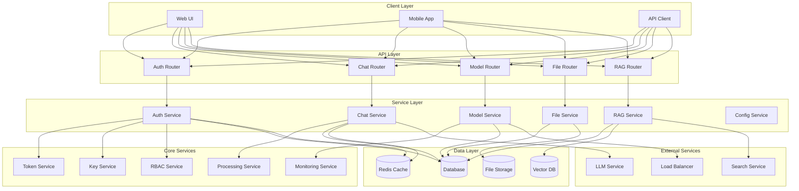

# System Architecture Overview

This document provides a high-level overview of the Open WebUI backend system architecture.

## System Architecture Diagram



## Component Relationships

### 1. Client Layer
- **Web UI**: Browser-based interface
- **Mobile App**: Native mobile applications
- **API Client**: Third-party integrations

### 2. API Layer
- **Auth Router**: Authentication and authorization endpoints
- **Chat Router**: Chat and conversation management
- **Model Router**: Model configuration and deployment
- **File Router**: File upload and management
- **RAG Router**: RAG system endpoints

### 3. Service Layer
- **Auth Service**: User authentication and authorization
- **Chat Service**: Chat processing and management
- **Model Service**: Model lifecycle management
- **File Service**: File processing and storage
- **RAG Service**: RAG system operations
- **Config Service**: System configuration management

### 4. Core Services
- **Token Service**: JWT token management
- **Key Service**: API key management
- **RBAC Service**: Role-based access control
- **Processing Service**: Content processing
- **Monitoring Service**: System monitoring

### 5. Data Layer
- **Database**: Primary data storage
- **Redis Cache**: Caching layer
- **Vector DB**: Vector storage for RAG
- **File Storage**: File system storage

### 6. External Services
- **LLM Service**: Language model service
- **Search Service**: Web search integration
- **Load Balancer**: Request distribution

## Key Interactions

### 1. Authentication Flow
```
Client -> Auth Router -> Auth Service -> Token Service -> Database/Cache
```

### 2. Chat Processing Flow
```
Client -> Chat Router -> Chat Service -> LLM Service -> Database/Cache
```

### 3. RAG Processing Flow
```
Client -> RAG Router -> RAG Service -> Vector DB -> Search Service
```

### 4. Model Management Flow
```
Client -> Model Router -> Model Service -> Load Balancer -> Database
```

### 5. File Management Flow
```
Client -> File Router -> File Service -> Storage -> Database
```

## Security Considerations

1. **Authentication**
   - JWT token validation
   - API key management
   - Session handling

2. **Authorization**
   - Role-based access control
   - Permission validation
   - Resource access control

3. **Data Security**
   - Encryption at rest
   - Secure communication
   - Data validation

4. **API Security**
   - Rate limiting
   - Input validation
   - Error handling

## Performance Considerations

1. **Caching Strategy**
   - Redis caching
   - Cache invalidation
   - Cache warming

2. **Load Balancing**
   - Request distribution
   - Health checks
   - Auto-scaling

3. **Database Optimization**
   - Query optimization
   - Index management
   - Connection pooling

4. **Resource Management**
   - Memory management
   - CPU utilization
   - Network optimization 