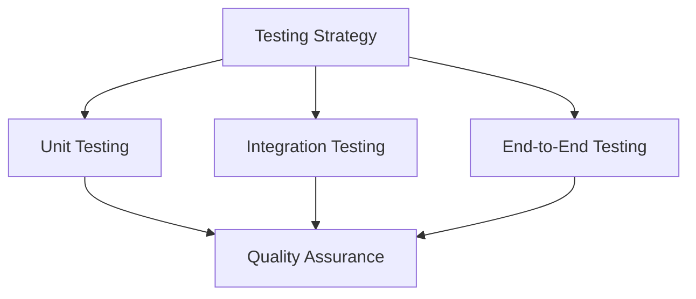

# Testing Documentation

This directory contains documentation for testing and quality assurance in the Open WebUI backend.

## Contents

### Testing Strategy
- [Testing and QA](testing_qa.md) - Testing strategies and quality assurance
- [Troubleshooting](troubleshooting.md) - Issue resolution and debugging

## Related Documentation
- See [monitoring/README.md](../monitoring/README.md) for monitoring testing
- See [deployment/README.md](../deployment/README.md) for deployment testing
- See [development/README.md](../development/README.md) for development testing

## Testing Overview

## Key Concepts
- Unit Testing
- Integration Testing
- End-to-End Testing
- Performance Testing
- Security Testing
- Troubleshooting

## Last Updated
- Testing and QA: 2024-03-21
- Troubleshooting: 2024-03-21 