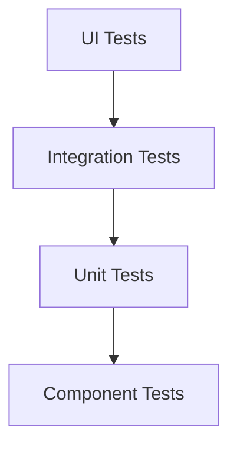

# Testing and Quality Assurance Documentation

This document provides comprehensive documentation for testing and quality assurance in the Open WebUI backend system.

## Testing Overview

### Testing Pyramid


## Unit Testing

### 1. Test Configuration
```python
class TestConfig:
    def __init__(self):
        self.test_database = "test_db"
        self.test_redis = "test_redis"
        self.test_elasticsearch = "test_es"
        self.test_vector_db = "test_vector_db"
        
    @pytest.fixture
    async def setup_test_env(self):
        """Setup test environment."""
        # Setup test database
        await self.setup_test_database()
        
        # Setup test Redis
        await self.setup_test_redis()
        
        # Setup test Elasticsearch
        await self.setup_test_elasticsearch()
        
        # Setup test Vector DB
        await self.setup_test_vector_db()
        
        yield
        
        # Cleanup
        await self.cleanup_test_env()
```

### 2. Test Cases
```python
class TestChatService:
    def __init__(self):
        self.chat_service = ChatService()
        
    @pytest.mark.asyncio
    async def test_create_chat(self):
        """Test chat creation."""
        # Arrange
        user_id = "test_user"
        model_id = "test_model"
        
        # Act
        chat = await self.chat_service.create_chat(
            user_id=user_id,
            model_id=model_id
        )
        
        # Assert
        assert chat.user_id == user_id
        assert chat.model_id == model_id
        assert chat.created_at is not None
        
    @pytest.mark.asyncio
    async def test_get_chat_history(self):
        """Test retrieving chat history."""
        # Arrange
        chat_id = "test_chat"
        messages = [
            {"role": "user", "content": "Hello"},
            {"role": "assistant", "content": "Hi"}
        ]
        
        # Act
        history = await self.chat_service.get_chat_history(chat_id)
        
        # Assert
        assert len(history) == 2
        assert history[0]["role"] == "user"
        assert history[1]["role"] == "assistant"
```

## Integration Testing

### 1. API Testing
```python
class TestAPI:
    def __init__(self):
        self.client = AsyncHTTPClient()
        self.base_url = "http://localhost:8000"
        
    @pytest.mark.asyncio
    async def test_chat_completion(self):
        """Test chat completion endpoint."""
        # Arrange
        payload = {
            "model": "test_model",
            "messages": [
                {"role": "user", "content": "Hello"}
            ],
            "temperature": 0.7
        }
        
        # Act
        response = await self.client.post(
            f"{self.base_url}/chat/completions",
            json=payload
        )
        
        # Assert
        assert response.status_code == 200
        data = response.json()
        assert "choices" in data
        assert len(data["choices"]) > 0
        
    @pytest.mark.asyncio
    async def test_document_processing(self):
        """Test document processing endpoint."""
        # Arrange
        files = {
            "file": ("test.pdf", open("test.pdf", "rb"))
        }
        
        # Act
        response = await self.client.post(
            f"{self.base_url}/rag/documents",
            files=files
        )
        
        # Assert
        assert response.status_code == 200
        data = response.json()
        assert "document_id" in data
        assert data["status"] == "processed"
```

### 2. Database Testing
```python
class TestDatabase:
    def __init__(self):
        self.db = Database()
        
    @pytest.mark.asyncio
    async def test_user_creation(self):
        """Test user creation in database."""
        # Arrange
        user_data = {
            "email": "test@example.com",
            "password": "test_password"
        }
        
        # Act
        user = await self.db.create_user(user_data)
        
        # Assert
        assert user.email == user_data["email"]
        assert user.password != user_data["password"]  # Should be hashed
        
    @pytest.mark.asyncio
    async def test_chat_storage(self):
        """Test chat storage in database."""
        # Arrange
        chat_data = {
            "user_id": "test_user",
            "model_id": "test_model",
            "messages": [
                {"role": "user", "content": "Hello"}
            ]
        }
        
        # Act
        chat = await self.db.create_chat(chat_data)
        
        # Assert
        assert chat.user_id == chat_data["user_id"]
        assert chat.model_id == chat_data["model_id"]
        assert len(chat.messages) == 1
```

## Performance Testing

### 1. Load Testing
```python
class LoadTester:
    def __init__(self):
        self.client = AsyncHTTPClient()
        self.base_url = "http://localhost:8000"
        
    async def test_chat_endpoint_load(self):
        """Test chat endpoint under load."""
        # Arrange
        num_requests = 100
        concurrent_requests = 10
        payload = {
            "model": "test_model",
            "messages": [{"role": "user", "content": "Hello"}]
        }
        
        # Act
        start_time = time.time()
        tasks = []
        for _ in range(num_requests):
            tasks.append(
                self.client.post(
                    f"{self.base_url}/chat/completions",
                    json=payload
                )
            )
            
        responses = await asyncio.gather(*tasks)
        
        # Assert
        duration = time.time() - start_time
        success_rate = sum(1 for r in responses if r.status_code == 200) / len(responses)
        assert success_rate >= 0.95
        assert duration < 30  # Should complete within 30 seconds
```

### 2. Stress Testing
```python
class StressTester:
    def __init__(self):
        self.client = AsyncHTTPClient()
        self.base_url = "http://localhost:8000"
        
    async def test_system_stress(self):
        """Test system under stress conditions."""
        # Arrange
        num_users = 50
        requests_per_user = 20
        payload = {
            "model": "test_model",
            "messages": [{"role": "user", "content": "Hello"}]
        }
        
        # Act
        start_time = time.time()
        tasks = []
        for user_id in range(num_users):
            for _ in range(requests_per_user):
                tasks.append(
                    self.client.post(
                        f"{self.base_url}/chat/completions",
                        json=payload,
                        headers={"X-User-ID": str(user_id)}
                    )
                )
                
        responses = await asyncio.gather(*tasks)
        
        # Assert
        duration = time.time() - start_time
        success_rate = sum(1 for r in responses if r.status_code == 200) / len(responses)
        assert success_rate >= 0.90
        assert duration < 60  # Should complete within 60 seconds
```

## Security Testing

### 1. Authentication Testing
```python
class SecurityTester:
    def __init__(self):
        self.client = AsyncHTTPClient()
        self.base_url = "http://localhost:8000"
        
    async def test_authentication(self):
        """Test authentication mechanisms."""
        # Test invalid token
        response = await self.client.get(
            f"{self.base_url}/user/profile",
            headers={"Authorization": "invalid_token"}
        )
        assert response.status_code == 401
        
        # Test expired token
        response = await self.client.get(
            f"{self.base_url}/user/profile",
            headers={"Authorization": "expired_token"}
        )
        assert response.status_code == 401
        
        # Test valid token
        token = await self.get_valid_token()
        response = await self.client.get(
            f"{self.base_url}/user/profile",
            headers={"Authorization": f"Bearer {token}"}
        )
        assert response.status_code == 200
```

### 2. Authorization Testing
```python
class AuthorizationTester:
    def __init__(self):
        self.client = AsyncHTTPClient()
        self.base_url = "http://localhost:8000"
        
    async def test_role_based_access(self):
        """Test role-based access control."""
        # Test admin access
        admin_token = await self.get_admin_token()
        response = await self.client.get(
            f"{self.base_url}/admin/users",
            headers={"Authorization": f"Bearer {admin_token}"}
        )
        assert response.status_code == 200
        
        # Test user access
        user_token = await self.get_user_token()
        response = await self.client.get(
            f"{self.base_url}/admin/users",
            headers={"Authorization": f"Bearer {user_token}"}
        )
        assert response.status_code == 403
```

## Best Practices

### 1. Test Organization
- Use proper test structure
- Implement proper fixtures
- Use meaningful test names
- Group related tests
- Use proper assertions

### 2. Test Coverage
- Aim for high coverage
- Test edge cases
- Test error scenarios
- Test boundary conditions
- Test integration points

### 3. Test Data
- Use test databases
- Create test fixtures
- Clean up test data
- Use proper isolation
- Use meaningful data

### 4. Performance Testing
- Test under load
- Test under stress
- Monitor resources
- Test scalability
- Test reliability

### 5. Security Testing
- Test authentication
- Test authorization
- Test input validation
- Test data protection
- Test access control

### 6. General
- Use proper tools
- Implement CI/CD
- Monitor test results
- Document test cases
- Review test code 